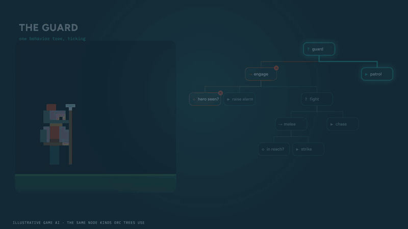
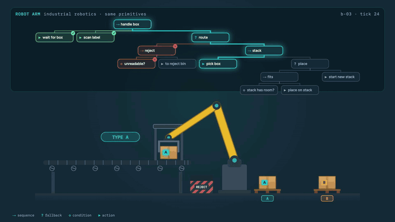
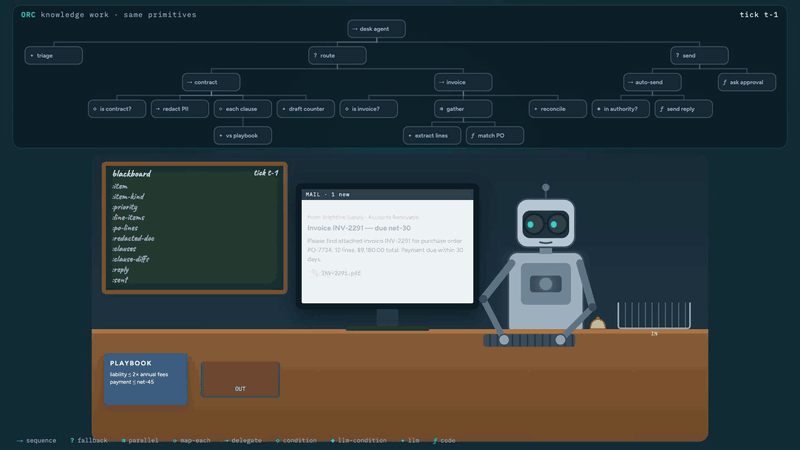
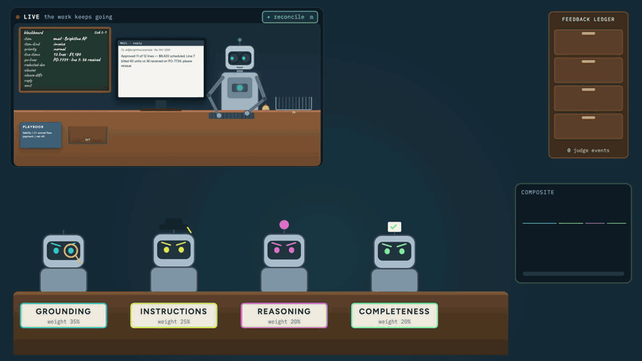
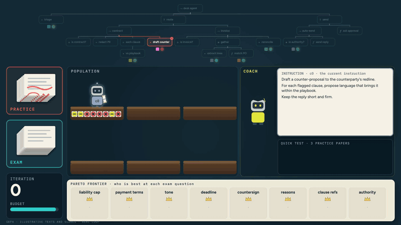
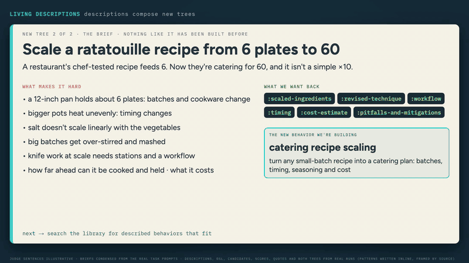
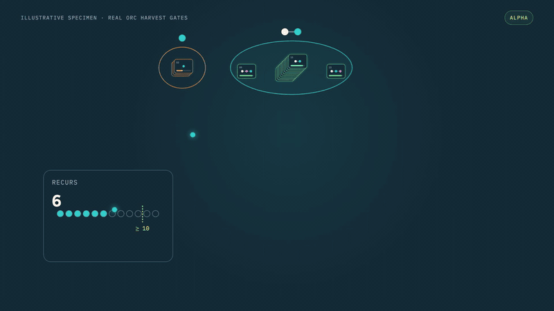
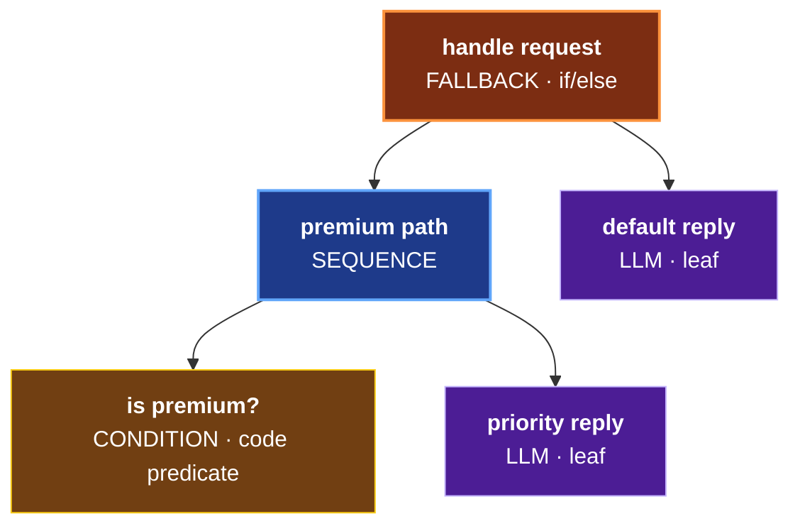

# ORC

**A laboratory and production line for accountable agentic software** — in Clojure, built on [Grain](https://github.com/ObneyAI/grain).

ORC records workflow executions so you can inspect results, evaluate individual nodes, and improve their instructions. Evaluation results also inform new workflows and help identify behaviors worth reusing. These improvements don't require model retraining.

Add ORC as a git dependency. [Choose a package](#pick-your-package) for workflow execution, evaluation, optimization, memory, or the full self-improving loop.

> **Early-stage software.** Expect breaking changes.

## New here?

Start with [Getting Started](docs/GETTING-STARTED.md), a contract-analysis walkthrough that adds evaluation, optimization, and memory to a basic workflow. The [documentation index](docs/README.md) lists the available guides.

## Behavior trees for AI workflows

Behavior trees have been used in games and robotics for decades. A tree ticks top-down: sequences run steps in order, fallbacks try alternatives, and conditions control which actions run. In ORC, nodes call language models or execute code. The tree defines execution order and failure handling.

<table>
<tr>
<td width="33%" align="center"><br><b>Games</b> — a guard's tree: patrol, spot, chase, strike</td>
<td width="33%" align="center"><br><b>Robotics</b> — scan, route, stack; a fallback starts a new pallet</td>
<td width="33%" align="center"><br><b>Knowledge work — ORC</b> — workflow nodes and typed blackboard reads/writes</td>
</tr>
</table>

Individual nodes can be inspected, evaluated, and optimized. See [How a run works](#how-a-run-works-behavior-trees) for an example with node inputs and outputs.

## The lab loop

### 1 · Build and run


The DSL builds workflows as Clojure data: trees of nodes such as `llm`, `code`, `condition`, and `delegate`, without writing events directly. Each node declares what it reads and writes on a typed blackboard. Nodes can pause for human input and resume afterward. → [Getting Started](docs/GETTING-STARTED.md) · [DSL Reference](docs/DSL-REFERENCE.md)

### 2 · Record execution


ORC uses Grain's event sourcing to record workflow execution as immutable events. Read models organize execution history for queries and analysis. → [Architecture](docs/ARCHITECTURE.md) · [Event Store Patterns](docs/EVENT-STORE-PATTERNS.md)

### 3 · Judge



Judges evaluate selected nodes asynchronously against criteria such as grounding, instruction following, reasoning, and completeness. Each evaluation records supporting evidence before assigning a score. → [Judge Architecture](docs/JUDGE-ARCHITECTURE.md) · [Evaluation](docs/EVALUATION-COMPONENT.md)

### 4 · Improve one node's instructions (GEPA)



GEPA uses a node's execution history to improve its instructions, retaining candidates on a Pareto frontier so gains on different evaluation criteria are preserved. → [GEPA Guide](docs/GEPA-GUIDE.md)

### 5 · Remember what works (Living Descriptions)



Judges' feedback becomes descriptions of a behavior's strengths, weaknesses, and suitable uses. The model retrieves these descriptions when designing new workflows. *(alpha)* → [Two worked examples](docs/LIVING-DESCRIPTIONS.md#watch-it-work-two-trees-nobody-had-built-before) · [Living Descriptions](docs/LIVING-DESCRIPTIONS.md) · [Self-Improving Loop](docs/SELF-IMPROVING-LOOP.md)

### 6 · Reuse successful behaviors



ORC promotes recurring patterns that meet its evaluation thresholds into named behaviors that other trees can delegate to. *(alpha; thresholds are still being calibrated)* → [Self-Improving Loop](docs/SELF-IMPROVING-LOOP.md)

<sub>The animations illustrate ORC mechanisms. The harvest animation uses older threshold values; see [Self-Improving Loop](docs/SELF-IMPROVING-LOOP.md) for current defaults.</sub>

> **Self-improving loop is alpha-stage.** The full loop works end-to-end on
> workflows that align with the shipped seed corpus, but force-fit classifications
> appear on out-of-distribution tasks. See [Self-Improving Loop](docs/SELF-IMPROVING-LOOP.md)
> for configuration and current limitations.

## Consumer Requirements

### Prerequisites

- **Java 21+** (with module access for LMDB)
- **Clojure CLI** (`brew install clojure/tools/clojure`)

### Application infrastructure

Applications using ORC provide:

- **Grain infrastructure**: a tenant-scoped event store (in-memory, SQLite, or Postgres) and an LMDB projection cache
- An **LLM provider**
- **Optional**: Langfuse client for tracing, MCP servers for tool calling

See [runtime setup](docs/GETTING-STARTED.md#wiring-a-context) for multi-instance deployment requirements.

## Pick your package

Choose a package for the capabilities you need; its dependencies are included.

| I want… | Pull this package | Heavy deps |
|---|---|:--:|
| Just run behavior trees (the engine) | `obneyai/orc-service` → `projects/orc-service` | — |
| …plus LLM-as-judge evaluation | `obneyai/orc-evaluation` → `projects/orc-evaluation` | — |
| …plus GEPA prompt optimization | `obneyai/orc-gepa` → `projects/orc-gepa` | — |
| …plus concept graph + DJL embeddings | `obneyai/orc-ontology` → `projects/orc-ontology` | DJL (JVM) |
| …plus ColBERT retrieval (added to ontology) | also `obneyai/orc-colbert` → `projects/orc-colbert` | DJL (JVM) |
| …plus MCP-driven tree generation | `obneyai/orc-mcp-sheet-builder` → `projects/orc-mcp-sheet-builder` | — |
| **Everything** / the full self-improving loop | `obneyai/orc` → `projects/orc` | DJL (JVM) |

Pin to a specific `:git/sha` and review the diff before updating.

```clojure
;; deps.edn — pick ONE row above; use its lib name + :deps/root
obneyai/orc-evaluation {:git/url "https://github.com/ObneyAI/orc.git"
                        :git/sha "..."                    ;; pin to a reviewed commit
                        :deps/root "projects/orc-evaluation"}
```

See [Packages](docs/PACKAGES.md) for dependency details.

### ColBERT Setup (Optional)

For ColBERT retrieval, add `orc-colbert` alongside `orc-ontology`. The full
self-improving loop requires the ColBERT component (pure JVM).

ColBERT downloads its model automatically on first use (~133 MB), then runs offline.
See [model configuration](docs/COLBERT-INTEGRATION.md#model-resolution-auto-download-cache-override)
for cache and air-gapped setup.

## Quick Start

With your [chosen package](#pick-your-package) installed, follow the
[context setup guide](docs/GETTING-STARTED.md#wiring-a-context) to configure `ctx`,
including the LLM provider selected by `:llm-provider`. Then define and execute a workflow:

```clojure
(require '[ai.obney.orc.orc-service.interface :as orc])

;; Define a workflow using the DSL
(def my-workflow
  (orc/workflow "summarizer"
    (orc/blackboard
      {:input   :string
       :summary :string})
    (orc/sequence "main"
      (orc/llm "summarize"
        :instruction "Summarize the input text in 2 sentences."
        :reads [:input]
        :writes [:summary]))))

;; Build it (idempotent — no-op if definition hasn't changed)
(orc/build-workflow! ctx my-workflow)

;; Execute it
(orc/execute ctx sheet-id {:input "Long article text..."})
;; => {:status :success, :outputs {:summary "..."}, :duration-ms 1234}
```

## How a run works: behavior trees

This contract-analysis workflow shows the blackboard keys each node reads and writes. NDA review is a separate workflow called through `:delegate`, shown expanded below. The `repl-researcher` node designs and runs its own subtree.

```mermaid
flowchart TB
  root["<b>contract-analysis</b><br/>FALLBACK"]:::fb
  root --> main
  root --> human["<b>escalate to human</b><br/>LLM · leaf<br/><i>hand off when unsure</i><hr/>▸ reads&nbsp;&nbsp;contract<br/>◂ writes&nbsp;&nbsp;summary"]:::llm
  subgraph MAIN["seq: analyze"]
    direction TB
    main["<b>analyze</b><br/>SEQUENCE"]:::seq
    main --> survey["<b>survey</b><br/>LLM · leaf 1<br/><i>extract key clauses</i><hr/>▸ reads&nbsp;&nbsp;contract<br/>◂ writes&nbsp;&nbsp;survey"]:::llm
    main --> diff["<b>diff vs prior</b><br/>LLM · leaf 2<br/><i>find changed terms</i><hr/>▸ reads&nbsp;&nbsp;survey<br/>◂ writes&nbsp;&nbsp;diff"]:::llm
    main --> route["<b>route by type</b><br/>FALLBACK · leaf 3"]:::fb
    main --> risk["<b>quantify risk</b> &#9662;<br/>REPL-RESEARCHER · leaf 4<br/><i>RLM designs + runs a subtree</i><hr/>▸ reads&nbsp;&nbsp;diff, survey<br/>◂ writes&nbsp;&nbsp;risk_class"]:::rlm
    main --> persist["<b>persist findings</b><br/>CODE · leaf 5<br/><i>write record via sci</i><hr/>▸ reads&nbsp;&nbsp;summary, risk_class<br/>◂ writes&nbsp;&nbsp;record"]:::code
    route --> isNDA{{"<b>is it an NDA?</b><br/>LLM-CONDITION<br/><i>route on yes / no</i><hr/>▸ reads&nbsp;&nbsp;contract"}}:::llmc
    isNDA --> NDA
    route --> summarize["<b>summarize clauses</b><br/>LLM · leaf<br/><i>plain-language brief</i><hr/>▸ reads&nbsp;&nbsp;diff<br/>◂ writes&nbsp;&nbsp;summary"]:::llm
    subgraph NDA["delegate → NDA review&nbsp;(peek inside) &#9662;"]
      direction TB
      ndaRoot["<b>NDA review</b><br/>SEQUENCE"]:::seq
      ndaRoot --> parties["<b>extract parties</b><br/>LLM · leaf<br/><i>who is bound</i><hr/>▸ reads&nbsp;&nbsp;contract<br/>◂ writes&nbsp;&nbsp;parties"]:::llm
      ndaRoot --> conf["<b>confidentiality check</b><br/>CODE · leaf<br/><i>required clauses present?</i><hr/>▸ reads&nbsp;&nbsp;contract<br/>◂ writes&nbsp;&nbsp;conf_ok"]:::code
    end
  end
  classDef fb fill:#7c2d12,stroke:#fb923c,color:#fff,stroke-width:2px;
  classDef seq fill:#1e3a8a,stroke:#60a5fa,color:#fff,stroke-width:2px;
  classDef llm fill:#4c1d95,stroke:#c4b5fd,color:#fff;
  classDef llmc fill:#5b21b6,stroke:#ddd6fe,color:#fff;
  classDef code fill:#0f766e,stroke:#5eead4,color:#fff;
  classDef rlm fill:#9d174d,stroke:#f9a8d4,color:#fff,stroke-width:2px;
```



See the [full contract-analysis walkthrough](docs/GETTING-STARTED.md) and the [node reference](#node-types).

## Node Types

| Node | Type | Description |
|------|------|-------------|
| `orc/sequence` | Composite | Run children in order. Fails on first failure. |
| `orc/fallback` | Composite | Run children in order. Succeeds on first success. |
| `orc/parallel` | Composite | Run all children concurrently. |
| `orc/map-each` | Composite | Map a subtree over a collection input. |
| `orc/llm` | Leaf | Call an LLM with an instruction and inputs to produce outputs. |
| `orc/code` | Leaf | Execute Clojure code (SCI sandbox). |
| `orc/condition` | Leaf | Branch based on code predicate. |
| `orc/llm-condition` | Leaf | Branch based on LLM yes/no judgment. |
| `orc/repl-researcher` | Leaf | Iterative: generate code, call MCP tools, refine. |
| `orc/delegate` | Leaf | Execute another workflow with isolated blackboard. |

Combine these nodes to express branching and fallback behavior. Here, a `fallback` tries a guarded `sequence`, then a default action if that sequence fails:



Swap the code `condition` for an `llm-condition` and the same shape becomes LLM-driven routing, such as judging whether a request is urgent.

A `repl-researcher` node can design and execute its own subtrees within a workflow; see the [RLM Guide](docs/RLM-GUIDE.md) for usage and execution modes.

## Architecture

ORC uses Grain for event sourcing and CQRS:

```
Commands -> Events -> Read Models -> Queries
               |
               v
         Todo Processors (side effects)
               ^
               |
       Periodic trigger events
```

Commands record durable events; tenant-scoped read models project them into queryable
state. Event processors execute workflow steps asynchronously. See
[Architecture](docs/ARCHITECTURE.md) for the implementation details.

- **Sheets** are behavior trees stored as event streams
- **Versioning** supports draft/published modes with stash/restore

### Execution Flow

```
1. orc/execute dispatches :sheet/tick-tree command
2. Command creates execution snapshot (isolated blackboard)
3. Event triggers todo processor (async)
4. Processor walks the behavior tree and dispatches nodes to their executors
5. Result delivered through the completion registry via a completion promise
```

### Durable operations

ORC supports [restart recovery](docs/ORC-SERVICE-GUIDE.md#restart-recovery),
[resumable optimization](docs/GEPA-GUIDE.md#resuming-and-publishing-a-winner),
[atomic retrieval-index switching](docs/COLBERT-INTEGRATION.md#stable-production-alias),
and [telemetry export](docs/ORC-SERVICE-GUIDE.md#failure-isolated-telemetry-export).

For production persistence and diagnostics, see [Value Storage](docs/VALUE-STORAGE.md)
and [Tracing and Correlation](docs/ORC-SERVICE-GUIDE.md#tracing-correlation-and-exact-node-io).

## Documentation

| Guide | Description |
|-------|-------------|
| [Docs index](docs/README.md) | Guides organized by stage of workflow development and operation |
| [Getting Started](docs/GETTING-STARTED.md) | Build a workflow, then add evaluation, optimization, and memory |
| [Packages](docs/PACKAGES.md) | Package selection and dependencies |
| [Component Map](docs/COMPONENT-MAP.md) | Opt-in layer table, full dependency graph, known issues |
| [Judge Architecture](docs/JUDGE-ARCHITECTURE.md) | Rubric design, judge types, custom judges, scale design, composite scoring |
| [ORC Principles](docs/ORC-PRINCIPLES.md) | Design principles, node selection, delegation, and event sourcing |
| [ORC Service Guide](docs/ORC-SERVICE-GUIDE.md) | Core execution engine and DSL reference |
| [DSL Reference](docs/DSL-REFERENCE.md) | DSL syntax and core concepts |
| [RLM Guide](docs/RLM-GUIDE.md) | Recursive Language Model usage, execution modes, and tree generation |
| [Architecture](docs/ARCHITECTURE.md) | System architecture and design decisions |
| [GEPA Guide](docs/GEPA-GUIDE.md) | Prompt optimization with GEPA |
| [Evaluation](docs/EVALUATION-COMPONENT.md) | LLM-as-judge evaluation framework |
| [ColBERT Integration](docs/COLBERT-INTEGRATION.md) | The pure-JVM late-interaction retrieval signal |
| [Ontology](docs/ONTOLOGY.md) | Custom graphs, source imports, and pattern discovery |
| [MCP Sheet Builder](docs/MCP-SHEET-BUILDER-GUIDE.md) | Dynamic workflow generation |
| [Self-Improving Loop](docs/SELF-IMPROVING-LOOP.md) | Alpha-stage: auto-classify, pattern evolution, behavior minting |
| [Event Store Patterns](docs/EVENT-STORE-PATTERNS.md) | Grain event sourcing patterns |

### Benchmarks

| Document | Description |
|---|---|
| [Bench README](development/bench/README.md) | How to run the 5-task generalization benchmark suite |
| [Bench RESULTS](development/bench/RESULTS.md) | Results from five tasks, including generated tree patterns and output checks |

## Development Setup

See [Contributor Grain Patterns](docs/contributors/CONTRIBUTOR-GRAIN-PATTERNS.md)
for the framework patterns used in this repository.

### Getting Started

```bash
# Clone
git clone git@github.com:ObneyAI/orc.git && cd orc

# Start nREPL (includes JVM flags for LMDB)
./scripts/nrepl.sh
```

### Running Tests

```bash
clj -M:poly test                     # changed bricks only
clj -M:poly test :all-bricks         # all bricks
clj -M:poly test brick:orc-service   # specific brick
```

### Project Structure

See the [Component Map](docs/COMPONENT-MAP.md) for component responsibilities and dependencies.

```
orc/
├── CLAUDE.md                  # AI assistant instructions
├── README.md
├── deps.edn                   # Dev alias + Polylith config
├── workspace.edn              # Polylith workspace (top-ns: ai.obney.orc)
├── scripts/
│   └── nrepl.sh               # nREPL launcher (JVM flags for LMDB)
├── components/               # Polylith components (see Component Map)
├── projects/                 # Standalone package configurations
├── development/
│   └── src/dev.clj            # REPL entry point
└── docs/                      # Component guides and architecture
```

## License

MIT. See [LICENSE](LICENSE).
