# The Evolutionary Ontology Pipeline — the full behavior tree

One page for the whole machine: the central evolver that turns a goal plus a set of
raw structured sources (CSV / SQL / Excel / text) into a validated concept graph,
drawn as behavior trees at every zoom level. The **objective is competency-question
satisfaction** — the pipeline derives the questions the graph must answer, builds,
gates itself against those questions, and routes every failing question to the one
focused subbehavior that can close it. Every failure, skip, and degrade path is a
**named route** on these charts — the honest paths are the point.

The spine is deterministic orchestration (`run-central-evolver!` in
`components/ontology/src/ai/obney/orc/ontology/core/central_evolver.clj`); the
knowledge work happens inside **delegated subbehavior sheets** — real, registered
ORC behavior trees invoked via `:delegate` with isolated blackboards. Before the
spine runs, `register-pipeline-sheets!` builds every subbehavior sheet through the
DSL (`build-workflow!`, idempotent), and every delegated step executes as a real
tick of the engine. "The model discovers, the skeleton orchestrates": LLMs decide
the entity model, author the extraction transforms, and judge the questions — the
deterministic spine guarantees the steps run, bounds every budget, and never lets a
failure dress itself up as a success.

> Each box declares its blackboard contract: `▸ reads` the keys it consumes,
> `◂ writes` the keys it produces.
>
> **Colour key:** 🟩 inputs · 🟦 SEQUENCE (children run in order) · 🟧 FALLBACK
> (first child that succeeds) · 🟨 CONDITION (a gate — pass or route) · 🟪 an LLM
> step · 🟦‑teal deterministic code (no LLM) · 🩷 REPL‑RESEARCHER / fan‑out · ⬛
> gray dashed = a `:delegate` to another sheet (marked `▾` — it opens into its own
> tree below) · ⬛ slate = a terminal status or produced contract.

---

## The whole machine at a glance

The entry point takes an ontology-id (the granted scope), the source descriptors,
the goal, and a judge function. A front-of-tree condition picks **greenfield vs
maintain** — and then *both arms run the same pipeline*, because every subbehavior
already works against current graph state. Eight steps, then the bounded
competency-question loop. Every early failure is a named terminal status, never a
silent stop.

```mermaid
flowchart TB
  caller["<b>run-central-evolver!</b><br/><i>the keystone entry point</i><hr/>▸ reads&nbsp;&nbsp;ontology-id, sources, goal, judge-fn"]:::input
  caller --> gvm(["<b>greenfield or maintain?</b><br/>CONDITION · code<hr/>▸ reads&nbsp;&nbsp;current graph projection"]):::cond
  gvm -->|"no graph yet → greenfield"| root
  gvm -->|"graph exists → maintain"| root

  subgraph PIPE["🌳 the shared evolver pipeline — BOTH arms run this"]
    direction TB
    root["<b>evolver pipeline</b><br/>SEQUENCE · one pass, then the bounded loop"]:::seq
    root --> s1[["<b>1 · Survey</b> &#9662;<br/>delegate · once per source<hr/>▸ reads&nbsp;&nbsp;goal, source-descriptor<br/>◂ writes&nbsp;&nbsp;profile"]]:::sub
    root --> s2[["<b>2 · Derive CQs + persist spec</b> &#9662;<br/>delegate<hr/>▸ reads&nbsp;&nbsp;goal, profiles<br/>◂ writes&nbsp;&nbsp;competency-questions"]]:::sub
    root --> s3[["<b>3 · Synthesize shared vocabulary</b> &#9662;<br/>delegate<hr/>▸ reads&nbsp;&nbsp;goal, profiles<br/>◂ writes&nbsp;&nbsp;vocabulary"]]:::sub
    root --> s4["<b>4 · per-source pipeline</b> &#9662;<br/>fan · each source in order, graph grows between<br/><i>graph-context → select → Model→Extract →<br/>Reconcile → Axiom/TBox → Embed+Index</i>"]:::fan
    root --> s5["<b>5 · global joins</b><br/>CODE · deterministic, no LLM<br/><i>family↔detail hierarchy + linking-key code-node spine</i>"]:::code
    root --> s6["<b>6 · build!</b><br/>CODE · deterministic skeleton<br/><i>dedup cascade → validate → embed → index → exit-criterion</i>"]:::code
    root --> s7["<b>7 · CQ gate</b><br/>in-process retrieve-then-judge<hr/>▸ reads&nbsp;&nbsp;persisted CQs, graph<br/>◂ writes&nbsp;&nbsp;cq-verdict, graph-health"]:::llm
    root --> s8["<b>8 · CQ-objective loop</b><br/>bounded LOOP · at most 3 focused iterations<br/><i>route each failing CQ to the closing subbehavior</i>"]:::fb
  end

  s8 --> done["<b>:complete</b><br/><i>the gate passed</i>"]:::out
  s8 --> fcq["<b>:failed-cq</b><br/><i>all-remaining-unanswerable or budget-exhausted<br/>— ALWAYS with a surfaced termination reason</i>"]:::out
  s8 --> partial["<b>:partial-reconcile</b><br/><i>≥ 1 source's drafts never landed; the loop's own<br/>status stays observable alongside</i>"]:::out
  s1 -.->|"a survey fails"| f1["<b>:failed-at-survey</b>"]:::out
  s2 -.->|"derivation fails"| f2["<b>:failed-at-derive-cqs</b>"]:::out
  s3 -.->|"synthesis fails"| f3["<b>:failed-at-synthesize-vocabulary</b>"]:::out
  s4 -.->|"any Model→Extract fails<br/>(after EVERY source ran)"| f4["<b>:failed-at-model-extract</b><br/><i>per-source reports still surfaced</i>"]:::out

  classDef input fill:#14532d,stroke:#4ade80,color:#fff,stroke-width:2px;
  classDef seq fill:#1e3a8a,stroke:#60a5fa,color:#fff,stroke-width:2px;
  classDef fb fill:#7c2d12,stroke:#fb923c,color:#fff,stroke-width:2px;
  classDef cond fill:#713f12,stroke:#facc15,color:#fff;
  classDef llm fill:#4c1d95,stroke:#c4b5fd,color:#fff;
  classDef code fill:#0f766e,stroke:#5eead4,color:#fff;
  classDef fan fill:#9d174d,stroke:#f9a8d4,color:#fff,stroke-width:2px;
  classDef sub fill:#1f2937,stroke:#94a3b8,color:#e5e7eb,stroke-dasharray:4 3;
  classDef out fill:#334155,stroke:#94a3b8,color:#fff,stroke-width:2px;
```

The final result envelope always records which arm ran (`:mode`), the branch
decision, the per-source outcome reports, the selection and hierarchy reports, the
verbatim `build!` result, and the loop history — so a zero-landed source or a
degraded rank is readable at a glance, never a false green.

---

## Greenfield or maintain — one pipeline, two starting states

The decision reads graph existence off the **same projection the reconcile pass
reconciles against** — no forked notion of "exists". Maintain is not a separate
build path: the per-source reconcile reads current graph state, so an existing
entity reconciles-not-duplicates (idempotent), a new source's new classes and
attributes land alongside the existing graph (the TBox evolves), and the CQ loop
re-gates the *updated* graph. Greenfield is simply the same code path against an
empty starting projection. An optional `:mode` override forces the arm for tests
or human review.

```mermaid
flowchart TB
  q(["<b>graph-exists?</b><br/>CONDITION · code<br/><i>the same projection the reconcile pass reads</i><hr/>▸ reads&nbsp;&nbsp;current graph concepts for the ontology-id"]):::cond
  q -->|"empty store"| g["<b>greenfield</b><br/><i>the pipeline runs against an empty graph</i>"]:::code
  q -->|"populated store"| m["<b>maintain</b><br/><i>the SAME pipeline against the existing graph —<br/>reconcile-not-duplicate · TBox grows · gate re-runs</i>"]:::code
  g --> p[["<b>shared evolver pipeline</b> &#9662;"]]:::sub
  m --> p

  classDef cond fill:#713f12,stroke:#facc15,color:#fff;
  classDef code fill:#0f766e,stroke:#5eead4,color:#fff;
  classDef sub fill:#1f2937,stroke:#94a3b8,color:#e5e7eb,stroke-dasharray:4 3;
```

---

## Survey — explore the source by shape

The first delegated subbehavior, and the **only one that warrants a
repl-researcher**: surveying genuinely needs an iterative tool-using session (look
at the shape, sample some rows, characterize). It runs in *terminal* mode — a few
granted tool calls, then `final!` — never designing a tree. One sheet is
registered per source (the granted source path is baked into the sheet's
identity), and the profile crosses the delegate seam as a parsed map, not a JSON
string.

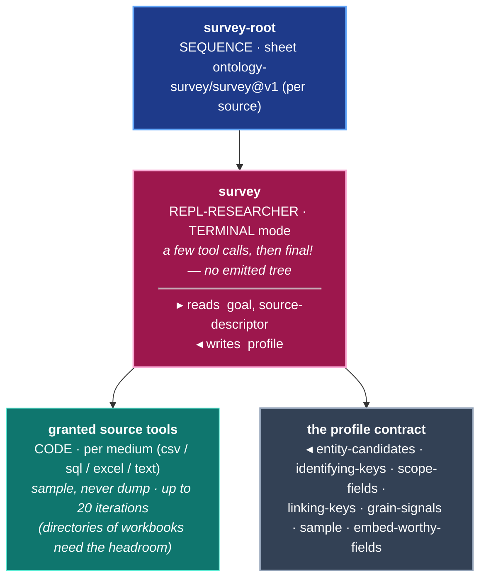

Two of the profile's fields are forward signals for later steps:
`embed-worthy-fields` names the free-text columns worth embedding (consumed by
Embed+Index), and `linking-keys` names the code/key columns likely to identify the
same entity in *other* sources (consumed by the cross-source join spine).

---

## Derive the competency questions — the objective, persisted

The Validate+CQ subbehavior turns the goal and the full set of per-source profiles
into the question set the built graph must answer, and persists them as the
ontology's requirements spec — the same spec the exit gate reads. A consumer can
supply its own questions, which override derivation. An empty question set is a
**failure**, never a pass: the exit gate must never have nothing to judge.

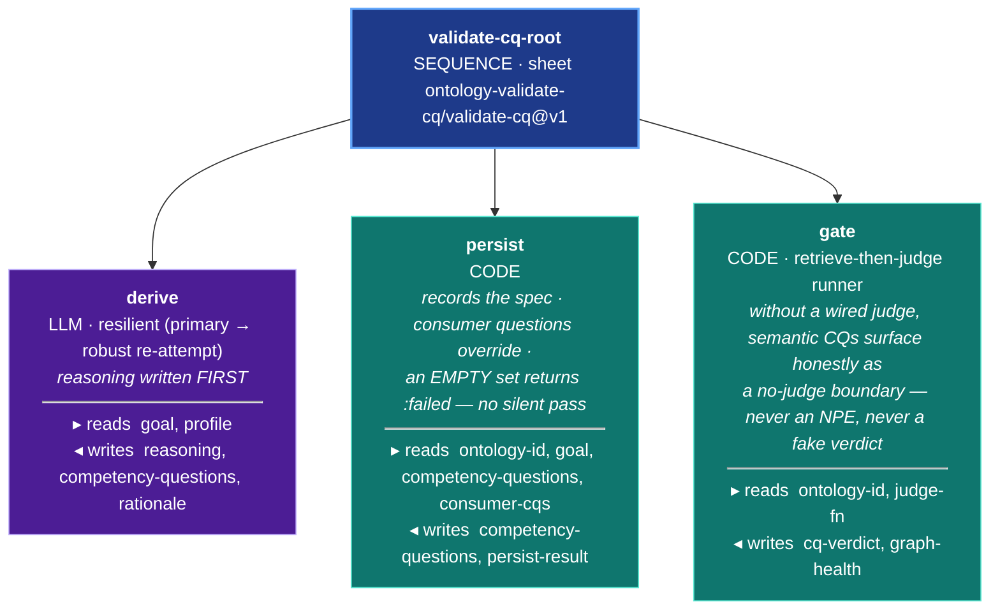

The judge is a Clojure **function value**, and function values cannot cross the
event-sourced `:delegate` blackboard — which is why this sheet's own gate node is
judge-optional, and why the *loop-time* gate (below) runs in-process where the
judge capability is available. Persisting goes through the record-ontology-spec
command and is confirmed by reading the projection back, never by trusting a
return value.

### Synthesize the shared vocabulary

Immediately after derivation, a sibling single-LLM-node subbehavior
(`synthesize-vocab`) reads the goal and the *same* full profile set and discovers
**one canonical entity-type vocabulary**: each canonical type carries the aliases
the different sources used for it, one canonical type name, one canonical set of
URI-keying fields (drawn from columns the sources actually report — never
invented), and a self-contained description. That vocabulary is threaded into
every per-source Model so the same real entity resolves to the same canonical URI
across sources — the difference between a connected graph and a fragmented one. A
synthesis failure is its own honest terminal (`:failed-at-synthesize-vocabulary`);
nothing extracts against a missing vocabulary.

---

## The per-source pipeline — Model → Extract → Reconcile → Axiom → Embed

The heart of step 4. Sources run **in order**, so a source processed later sees
the graph the earlier sources already built (via a fresh graph-context snapshot).
The statuses of every seam are *captured*, never fire-and-forget: a reconcile that
times out marks the run `:partial-reconcile` rather than letting a zero-landed
source hide inside a green loop status.

```mermaid
flowchart TB
  psrc["<b>one source</b><br/><i>sources run sequentially — the graph grows between them</i>"]:::input
  psrc --> gc["<b>graph-context snapshot</b><br/>CODE · read-only<br/><i>existing entity types + keying + predicates + a sample —<br/>so the Model attaches to existing entities, not re-mints them</i><hr/>◂ writes&nbsp;&nbsp;graph-context"]:::code
  gc --> selc["<b>select containers</b><br/>CODE + a delegated LLM rank<br/><i>structural pre-filter → CQ-coverage-aware relevance rank →<br/>bounded take · a failed rank degrades honestly to list order</i><hr/>▸ reads&nbsp;&nbsp;source, goal, competency-questions<br/>◂ writes&nbsp;&nbsp;selected-containers, selection-report"]:::code
  selc --> mx[["<b>Model → Extract</b> &#9662;<br/>delegate · the fixed per-source pipeline sheet<br/><i>timeout scaled to the container cap, not a flat default</i><hr/>▸ reads&nbsp;&nbsp;goal, profile, source, vocabulary, graph-context,<br/>caps, selected-containers<br/>◂ writes&nbsp;&nbsp;model-spec, candidate-axioms, embed-fields,<br/>concept-drafts, relationship-drafts, extraction-report"]]:::sub
  mx --> mxok(["<b>succeeded?</b><br/>CONDITION · code"]):::cond
  mxok -->|"failed AND the read-back vocabulary<br/>is EMPTY (a transient crossing loss)"| retry["<b>vocabulary-recovery retry</b><br/>CODE · bounded, at most 3 re-runs<br/><i>identical inputs · retry count surfaced on every return ·<br/>the first raw degraded spec kept VERBATIM as the dossier</i>"]:::code
  retry --> mx
  mxok -->|"failed (a genuine extract failure —<br/>non-empty vocabulary, no retry)"| abort["<b>run status :failed-at-model-extract</b><br/><i>declared AFTER every source ran ·<br/>earlier sources' landings stay readable</i>"]:::out
  mxok -->|"success"| rc[["<b>Reconcile</b> &#9662;<br/>delegate · timeout scaled to the DRAFT COUNT it probes<hr/>▸ reads&nbsp;&nbsp;ontology-id, concept-drafts, relationship-drafts, source-uri-sets<br/>◂ writes&nbsp;&nbsp;reconcile-report"]]:::sub
  rc --> rcst(["<b>reconcile status — CAPTURED</b><br/>CONDITION · never fire-and-forget"]):::cond
  rcst -->|"non-success (timeout / failure)"| pr["<b>source marked · run CONTINUES</b><br/><i>later sources are independent — keep landing them ·<br/>final status becomes :partial-reconcile ·<br/>the error travels bounded in the source-report</i>"]:::out
  rcst -->|"success"| ax
  pr --> ax[["<b>Axiom / TBox</b> &#9662;<br/>delegate<hr/>▸ reads&nbsp;&nbsp;ontology-id, candidate-axioms, model-spec<br/>◂ writes&nbsp;&nbsp;axiom-report"]]:::sub
  ax --> em[["<b>Embed + Index</b> &#9662;<br/>delegate · guaranteed by default, no caller wiring<hr/>▸ reads&nbsp;&nbsp;ontology-id, embed-fields<br/>◂ writes&nbsp;&nbsp;embed-index-report"]]:::sub
  em --> rep["<b>source-report</b><br/>◂ extracted counts · reconcile status + landed count ·<br/>axiom status · embed status<br/><i>a seam that never ran reports :not-run — never fabricated</i>"]:::out

  classDef input fill:#14532d,stroke:#4ade80,color:#fff,stroke-width:2px;
  classDef code fill:#0f766e,stroke:#5eead4,color:#fff;
  classDef cond fill:#713f12,stroke:#facc15,color:#fff;
  classDef sub fill:#1f2937,stroke:#94a3b8,color:#e5e7eb,stroke-dasharray:4 3;
  classDef out fill:#334155,stroke:#94a3b8,color:#fff,stroke-width:2px;
```

Two budget disciplines make the honest paths possible. The Model→Extract delegate's
deadline is **derived from the container cap** (a per-container budget times the
cap, plus a fixed overhead) so it tracks the real work instead of a flat default
that used to cut multi-container extractions mid-flight. The Reconcile delegate's
deadline is **derived from the draft count it will probe** — the fix for
reconciles that silently timed out and landed zero concepts while the run claimed
success.

After the last source, two deterministic **global joins** run over the whole
landed graph (no LLM): a structural prefix detector bridges same-type concepts at
different code-system grains (family ↔ detail, landed as `skos:narrower` edges
through the normal Reconcile path), and the **linking-key spine** aggregates the
discovered linking-key names across all model-specs, mints one code node per
distinct (key, value), and attaches every carrier via an `identified-by` edge — so
concepts from different sources sharing a code value join through one node. Both
report edge counts and honest truncations.

### Model — the modeling decision

A single-turn LLM reasoning node (no tools, no tree): goal × profile ×
vocabulary × graph-context → the entity model. It decides the entity types (each
with URI-keying fields and a grain strategy), the scope filter, the edges, the
embed-worthy fields, the linking-key carry-forward, and the candidate TBox axioms.
The prompt's default is flat modeling — reification into an observation node is a
rare, twice-guarded exception, and a pairing between two entities is an **edge,
never a node**. With resilience on, the node is wrapped in the ladder below with a
semantic usability gate (is there at least one usable entity type?).

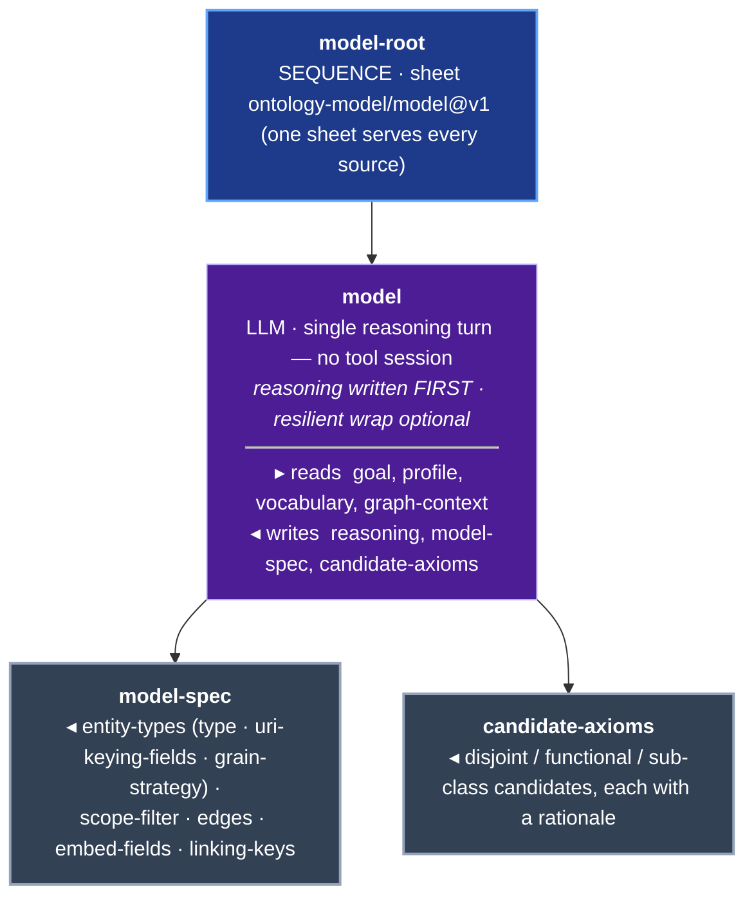

### Extract — one orchestrator, one unit per container

The public Extract sheet is a thin orchestrator: one `:code` node that enumerates
the source's containers (tables / sheets / files) and drives the per-container
**sample → author → apply** unit once per container as an isolated child tick,
with bounded concurrency. First, a hard stop: extraction never proceeds against an
empty entity-type vocabulary — that would guarantee every container inventing its
own type names. Accumulation is deterministic: reconcile any proposed new types,
rewrite every draft URI to its canonical form, then join entities *across*
containers by the source's own declared relations.

```mermaid
flowchart TB
  xroot["<b>extract-root</b><br/>SEQUENCE · the public sheet ontology-extract@v1"]:::seq
  xroot --> orch["<b>orchestrate-containers</b><br/>CODE · the multi-container orchestrator<hr/>▸ reads&nbsp;&nbsp;source, model-spec, max-containers, max-windows, selected-containers<br/>◂ writes&nbsp;&nbsp;concept-drafts, relationship-drafts, extraction-report"]:::code
  orch --> stop(["<b>usable entity-type vocabulary?</b><br/>CONDITION · HARD STOP<br/><i>empty entity-types → throw loudly —<br/>never a silent zero-draft run</i>"]):::cond
  stop --> pick["<b>containers to drive</b><br/>CODE<br/><i>the ranked selection when present,<br/>else take the first N under the cap (25)</i>"]:::code
  pick --> fan["<b>per-container child ticks</b><br/>fan · bounded concurrency (5)<br/><i>each tick: own blackboard, own resilience gate,<br/>own reasoning — no cross-container bleed</i>"]:::fan
  fan --> unit
  subgraph UNIT["📦 the per-container unit — sample → author → apply"]
    direction TB
    unit["<b>extract-root (per container)</b><br/>SEQUENCE"]:::seq
    unit --> smp["<b>sample-rows</b><br/>CODE<br/><i>real rows straight from the medium's own tools —<br/>the authoritative key shape, never a re-keyed LLM sample</i><hr/>▸ reads&nbsp;&nbsp;source, container<br/>◂ writes&nbsp;&nbsp;sample-rows"]:::code
    unit --> aa["<b>author → apply</b> &#9662;<br/>RESILIENT FALLBACK · see the ladder below<br/><i>author: an LLM writes the per-row transform (or an<br/>aggregation spec for long-form containers) ·<br/>apply: code streams the container window-by-window</i><hr/>▸ reads&nbsp;&nbsp;model-spec, sample-rows, container<br/>◂ writes&nbsp;&nbsp;concept-drafts, relationship-drafts,<br/>extraction-report, concept-count"]:::fb
  end
  fan --> acc["<b>accumulate</b><br/>CODE · deterministic<br/><i>reconcile proposed new entity types → canonical URI minting<br/>(same identity values → same URI, byte-identical) →<br/>cross-container edges joined on shared key VALUES</i>"]:::code
  acc --> xrep["<b>extraction-report</b><br/>◂ per-container coverage + failures with diagnosis ·<br/>canonicalization degrades · relation + blocking truncations ·<br/>the proposal ledger — all honest, nothing dropped"]:::out

  classDef seq fill:#1e3a8a,stroke:#60a5fa,color:#fff,stroke-width:2px;
  classDef code fill:#0f766e,stroke:#5eead4,color:#fff;
  classDef cond fill:#713f12,stroke:#facc15,color:#fff;
  classDef fb fill:#7c2d12,stroke:#fb923c,color:#fff,stroke-width:2px;
  classDef fan fill:#9d174d,stroke:#f9a8d4,color:#fff,stroke-width:2px;
  classDef out fill:#334155,stroke:#94a3b8,color:#fff,stroke-width:2px;
```

### The resilience ladder — self-correct or fail cleanly with a diagnosis

Every failure-prone LLM step in the pipeline (the extract author→apply, the Model,
the CQ derivation) is wrapped in the same reusable sub-tree. Its load-bearing
property: there are exactly **two outcomes** — recover (primary or robust passes
the sanity gate) or a clean `:failure` carrying a structured diagnosis. There is
no third outcome where a bad intermediate state launders into a success: the
diagnose branch ends in an always-fail condition, so the troubleshoot's own
success can never turn the step green. Shown here with the extract step's real
node names.

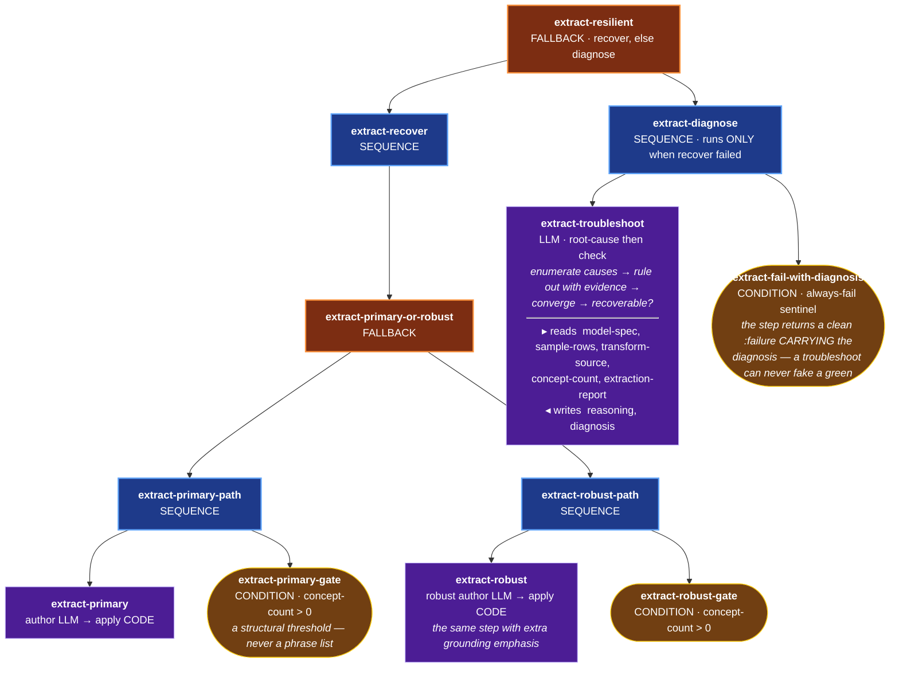

The sanity gate comes in two flavors: a deterministic `:condition` where a flat
count can decide (extract's `concept-count > 0`), and a semantic `:llm-condition`
yes/no where judgment is needed (the Model's "is this a usable entity model?", the
derivation's "is there at least one usable question?").

### Reconcile — check before mint, then land, then link

Reconcile is deterministic — one `:code` leaf running a four-step orchestration
with an LLM budget that **defaults to zero**: ambiguities surface as
`requires-review`, never a silent merge.

```mermaid
flowchart TB
  rroot["<b>reconcile-root</b><br/>SEQUENCE · sheet ontology-reconcile/reconcile@v1"]:::seq
  rroot --> rnode["<b>reconcile</b><br/>CODE · one leaf, four deterministic steps · llm-budget 0<hr/>▸ reads&nbsp;&nbsp;ontology-id, concept-drafts, relationship-drafts, source-uri-sets<br/>◂ writes&nbsp;&nbsp;reconcile-report"]:::code
  rnode --> p1["<b>1 · probe — check-before-mint</b><br/><i>exact-URI fast path FREE for every draft (already-known URI →<br/>reconcile-into-existing, no search spent) · hybrid search<br/>(graph BFS + embedding + ColBERT) for up to 2000 new drafts ·<br/>batched query embeddings · a 10-minute wall clock —<br/>cap or budget exceeded is REPORTED in probe-coverage, never silent</i>"]:::code
  p1 --> p2["<b>2 · land</b><br/><i>drafts → create-concept / create-relationship commands ·<br/>the referential-integrity invariant always on — events LAND,<br/>the result is read back from the projection</i>"]:::code
  p2 --> p3["<b>3 · entity reconcile</b><br/><i>against CURRENT graph state · shared-URI collapse +<br/>the near-match dedup cascade · ambiguity band → requires-review</i>"]:::code
  p3 --> p4["<b>4 · attribute reconcile</b><br/><i>the new entities' attributes vs existing entities' attributes ·<br/>same-value and shared-key links · structural key similarity ≥ 0.92 ·<br/>memoized per distinct key pair — bounded, output-identical</i>"]:::code
  p4 --> rrep["<b>reconcile-report</b><br/>◂ mint-probe + probe-coverage · landed provenance ·<br/>entity-reconcile · attribute-reconcile ·<br/>dangling-edge-count · ambiguities-surfaced"]:::out

  classDef seq fill:#1e3a8a,stroke:#60a5fa,color:#fff,stroke-width:2px;
  classDef code fill:#0f766e,stroke:#5eead4,color:#fff;
  classDef out fill:#334155,stroke:#94a3b8,color:#fff,stroke-width:2px;
```

### Axiom / TBox — every candidate accounted for

Deterministic coercion, no LLM: the Model already did the reasoning (each
candidate carries its rationale). Each candidate kind maps onto the matching
axiom command, its class and predicate references are grounded against the *real*
graph (exact URI or exact label; a predicate must actually be in use), and the
result is read back from the projection. The ledger closes a silent-drop bug:
nothing is ever skipped without a name.

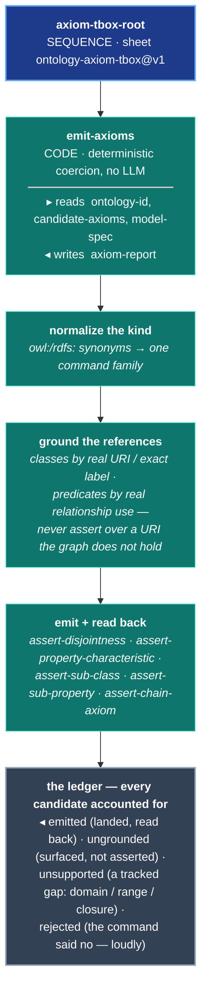

### Embed + Index — semantic retrievability by default, honest skips

One deterministic `:code` leaf makes the graph semantically retrievable with no
caller wiring. The load-bearing detail is that indexing goes through the
**create-index command** — so the index-created event lands and the index is
*resolvable* by later hybrid searches, not a green-by-completion artifact no query
can find. Every skip is a named, non-fatal class; every other error propagates.

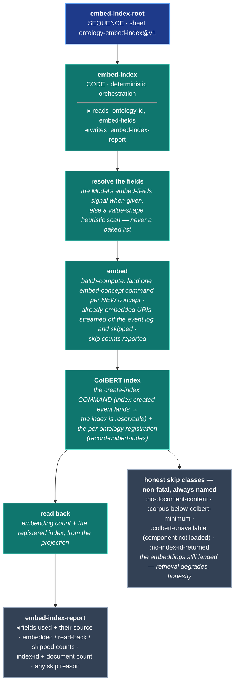

---

## build! — the deterministic skeleton over the landed graph

Step 6 runs the seven-stage skeleton over the graph the sources already landed
(its own ingest source is an empty inline list — nothing new enters here). Each
stage can fail into its own named status; the exit-criterion stage is the same CQ
gate the loop uses, applied once. The index stage recognizes exactly two
capability boundaries as non-fatal (the index is a rebuildable retrieval
accelerator, not the graph); everything else propagates.

```mermaid
flowchart TB
  b0["<b>build!</b><br/>CODE · the deterministic skeleton<br/><i>runs over the ALREADY-LANDED graph</i>"]:::code
  b0 --> bp["<b>parse</b>"]:::code
  bp --> bn["<b>normalize</b><br/><i>+ the referential-integrity report —<br/>reported on EVERY completed build</i>"]:::code
  bn --> bd["<b>dedup</b> &#9662;<br/><i>the cascade — zoomed below</i>"]:::fan
  bd --> bv["<b>validate</b><br/><i>shapes registered + linted when supplied ·<br/>skipped when none · violations can HALT</i>"]:::code
  bv --> be["<b>embed</b>"]:::code
  be --> bi["<b>index</b><br/><i>honest non-fatal skips: :no-embeddable-content ·<br/>:corpus-below-colbert-minimum · :colbert-index-timeout</i>"]:::code
  bi --> bx(["<b>exit-criterion</b><br/>CONDITION · pass-rate ≥ 0.8 AND unknown-rate ≤ 0.3<br/><i>no spec stored → no gate, by design</i>"]):::cond
  bx -->|pass| bdone["<b>:complete</b><br/>◂ counts · dedup-summary · integrity ·<br/>graph-health · SHACL export"]:::out
  bx -->|fail| bfail["<b>:failed-cq</b><br/><i>with graph-health + the exact rates</i>"]:::out
  bd --> DEDUP
  subgraph DEDUP["🧹 the dedup cascade — sub-quadratic, verdict-invariant"]
    direction TB
    d1["<b>stream light concepts</b><br/>CODE · uri / label / description / type only —<br/>heavy attributes never materialize"]:::code
    d1 --> d2["<b>LSH / MinHash blocking</b><br/><i>candidate neighborhoods instead of all pairs ·<br/>per-bucket + total caps reported honestly</i>"]:::code
    d2 --> d3["<b>project once</b><br/><i>disjointness axioms + the evidence ledger —<br/>once per stage, not once per pair</i>"]:::code
    d3 --> d4(["<b>pure pre-filter</b><br/>CONDITION tiers · no command, no event<br/><i>T1 disjointness guard · T2 number guard · T3 negation guard ·<br/>T4 entropy gate · T5 type blocking · T7 LSH-jaccard</i>"]):::cond
    d4 -->|"survivors only"| d5["<b>the full cascade command</b><br/><i>T6 exact-normalization merge · T8 string-similarity band<br/>(high → merge · below band → distinct) · T9 LLM verdict —<br/>budget 0 by default → :requires-review, never a silent merge</i>"]:::code
    d5 --> d6["<b>verdicts</b><br/>◂ merge (an equivalence lands) · distinct · skip ·<br/>requires-review — collected, never halting the build"]:::out
  end

  classDef code fill:#0f766e,stroke:#5eead4,color:#fff;
  classDef cond fill:#713f12,stroke:#facc15,color:#fff;
  classDef fan fill:#9d174d,stroke:#f9a8d4,color:#fff,stroke-width:2px;
  classDef out fill:#334155,stroke:#94a3b8,color:#fff,stroke-width:2px;
```

---

## The CQ gate — retrieve, then judge, then ground

The gate evaluates every persisted question, one verdict event per question, and
reads graph-health back from the projection. Questions route by shape: a
structural question ("does X exist?") gets a deterministic existence check with no
LLM; a semantic question retrieves evidence (hybrid search plus a bounded
enumeration of the graph and its explicit closure signals) and hands it to the
injected judge. `:unknown` is a first-class verdict — the graph lacking a fact
kind is an answer, never collapsed into pass/fail. A judge that returns nothing
raises; there is no silent fallback.

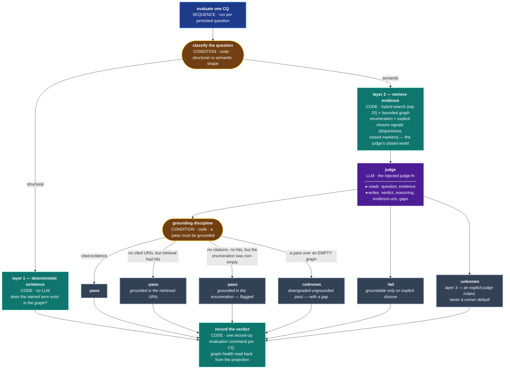

At loop time this gate runs **in-process** (not via `:delegate`) because the judge
is a function value that cannot cross the event-sourced delegate blackboard.

---

## The CQ-objective loop — route the gap to the step that closes it

The loop is the keystone's control flow: gate, and if a question fails, one
adaptive LLM decision node maps the failing question plus graph-health onto the
subbehavior that closes the gap — reasoning written first, the decision a real
keyword in a closed set, never a phrase-matching table. One question per
iteration, at most three iterations, and the loop **always terminates with a
surfaced reason**. A close that grows the graph by nothing toward its question
marks that question unanswerable — the source genuinely lacks it — and the loop
stops chasing it.

```mermaid
flowchart TB
  lgate["<b>gate the graph</b><br/>in-process retrieve-then-judge<hr/>◂ writes&nbsp;&nbsp;cq-verdict, graph-health"]:::llm
  lgate --> pass(["<b>where are we?</b><br/>CONDITION · code"]):::cond
  pass -->|"gate passed"| ldone["<b>:complete</b><br/><i>termination: cq-gate-passed</i>"]:::out
  pass -->|"3 iterations spent"| lbud["<b>:failed-cq</b><br/><i>termination: budget-exhausted —<br/>still-failing verdict attached</i>"]:::out
  pass -->|"every failing CQ already<br/>marked unanswerable"| lun["<b>:failed-cq</b><br/><i>termination: all-remaining-unanswerable —<br/>no spin, no false green</i>"]:::out
  pass -->|"a targetable failing CQ"| route{{"<b>route</b><br/>LLM · ONE decision node, reasoning FIRST<hr/>▸ reads&nbsp;&nbsp;failing-cq, graph-health<br/>◂ writes&nbsp;&nbsp;reasoning, route"}}:::llmc
  route -->|":extract or :model —<br/>a missing entity / mis-modeled grain"| cx[["<b>focal re-model + re-extract</b> &#9662;<br/><i>the same pipeline sheet, same vocabulary, same caps,<br/>current graph in context — then re-land + re-embed</i>"]]:::sub
  route -->|":reconcile —<br/>a missing link between existing entities"| cr[["<b>re-link the current graph</b> &#9662;<br/><i>reconcile with empty drafts — no new extraction</i>"]]:::sub
  route -->|":axiom —<br/>a missing class/attribute constraint"| ca[["<b>re-emit TBox</b> &#9662;<br/><i>from the held candidate axioms</i>"]]:::sub
  route -->|":terminate —<br/>the source genuinely lacks it"| ct["<b>mark unanswerable</b><br/><i>surfaced + stop chasing — honestly</i>"]:::out
  cx --> grew(["<b>did the graph grow?</b><br/>CONDITION · code · size before vs after"]):::cond
  cr --> grew
  ca --> grew
  grew -->|"yes — re-gate"| lgate
  grew -->|"no — the close supplied nothing<br/>toward this CQ"| ct
  ct --> pass

  classDef llm fill:#4c1d95,stroke:#c4b5fd,color:#fff;
  classDef llmc fill:#5b21b6,stroke:#ddd6fe,color:#fff;
  classDef cond fill:#713f12,stroke:#facc15,color:#fff;
  classDef sub fill:#1f2937,stroke:#94a3b8,color:#e5e7eb,stroke-dasharray:4 3;
  classDef out fill:#334155,stroke:#94a3b8,color:#fff,stroke-width:2px;
```

Every iteration's history entry records the failing question, the route, the
route's reasoning, the close status, whether the graph grew, and any reconcile
error (bounded to a readable prefix — the full error stays in the node-execution
events).

---

## Where the model discovers — the RLM sandbox session

The discovery entry point (`rlm_discovery.clj`) is the clearest picture of "the
model discovers, the skeleton orchestrates". A recursive repl-researcher session
is granted bounded, per-format sandbox tools over one structured source. The model
explores, then hands back drafts **plus a sample-validated extraction transform**
— and the deterministic skeleton streams the *full* source through that transform,
so comprehensive coverage never depends on the model looping over rows. (The
per-container Extract unit above reuses exactly this apply step.)

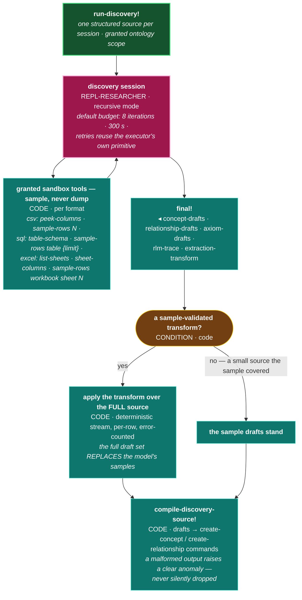

The session's iterations, generated trees, and executions are observable through
the engine's RLM event vocabulary (see the appendix).

---

## The accretion mode — one source per run, one growing graph

The system's intended operating mode: source-by-source accretion into a single
persistent store (`development/src/incremental_graph_b.clj`). A manifest records
the store coordinates and which sources are done; each invocation runs exactly the
next unfinished source through the full central evolver against the same
ontology-id. Run 1 is greenfield; every later run must take the maintain branch —
a mismatch is printed as a finding, never papered over. A source only counts as
done when **its reconcile succeeded**: a partial-reconcile run leaves it in place
for the next invocation to retry. The store survives every exit path.

```mermaid
flowchart TB
  man["<b>manifest</b><br/><i>store coordinates + completed sources —<br/>written BEFORE the first run (crash-safety)</i>"]:::input
  man --> nxt(["<b>an unfinished source?</b><br/>CONDITION · code"]):::cond
  nxt -->|"none left"| donea["<b>ACCRETION COMPLETE</b><br/><i>print full graph stats · preserve the store · exit</i>"]:::out
  nxt -->|"yes"| ctx["<b>open the store</b><br/>CODE · fresh on run 1, reused after —<br/><i>same ontology-id every run</i>"]:::code
  ctx --> expct["<b>expected branch</b><br/>CODE<br/><i>run 1 → greenfield · runs 2+ → maintain ·<br/>a mismatch is a loud printed FINDING</i>"]:::code
  expct --> run[["<b>run-central-evolver!</b> &#9662;<br/>ONE source · the full pipeline + CQ loop"]]:::sub
  run --> rst(["<b>this source's reconcile status?</b><br/>CONDITION · read from the per-source reports —<br/>:not-run when the run died early, never fabricated"]):::cond
  rst -->|":success"| adv["<b>advance the manifest</b><br/><i>source marked complete</i>"]:::code
  rst -->|"anything else"| rty["<b>do NOT advance</b><br/><i>the next invocation retries the same source</i>"]:::code
  adv --> pres["<b>preserve the store</b><br/><i>every exit path — the graph is never deleted</i>"]:::out
  rty --> pres

  classDef input fill:#14532d,stroke:#4ade80,color:#fff,stroke-width:2px;
  classDef cond fill:#713f12,stroke:#facc15,color:#fff;
  classDef code fill:#0f766e,stroke:#5eead4,color:#fff;
  classDef sub fill:#1f2937,stroke:#94a3b8,color:#e5e7eb,stroke-dasharray:4 3;
  classDef out fill:#334155,stroke:#94a3b8,color:#fff,stroke-width:2px;
```

---

## Appendix — the full command / event vocabulary

Everything the three interface schemas declare
(`components/ontology/.../interface/schemas.clj`,
`components/orc-service/.../interface/schemas.clj`,
`components/colbert/.../interface/schemas.clj`), each mapped to where it appears
in the charts above — or honestly marked as vocabulary this pipeline does not
touch. **Placement legend:** a chart/section name means the command/event fires at
that drawn node; *engine substrate* means it belongs to the behavior-tree engine
every delegated sheet runs on; *self-improving loop* means it belongs to the
workflow-classification/living-descriptions system, a sibling capability of the
ontology component that this pipeline does not drive; *legacy builder* means the
earlier evolutionary-builder path (a predecessor the central evolver replaced —
still shipped, not invoked here). Rows marked ◇ are attributions from schema-file
comments and docstrings whose exact dispatch site was not re-traced in this pass.

### Ontology commands (49)

| Command | Where in this pipeline |
|---|---|
| `:ontology/create-concept` | Reconcile step 2 (land) · the global joins · discovery compile |
| `:ontology/create-relationship` | Reconcile step 2 (land) · the global joins · discovery compile |
| `:ontology/record-ontology-spec` | Derive CQs → persist node |
| `:ontology/record-cq-evaluation` | CQ gate — one per question evaluated |
| `:ontology/embed-concept` | Embed+Index — one per newly-embedded concept |
| `:ontology/record-colbert-index` | Embed+Index — registers the per-ontology index mapping |
| `:ontology/run-dedup-cascade` | build! dedup — dispatched for cascade survivors only |
| `:ontology/assert-disjointness` | Axiom/TBox emit |
| `:ontology/assert-property-characteristic` | Axiom/TBox emit |
| `:ontology/assert-sub-class` | Axiom/TBox emit (minted specifically to close the sub-class silent drop) |
| `:ontology/assert-sub-property` | Axiom/TBox emit |
| `:ontology/assert-chain-axiom` | Axiom/TBox emit (part of the same command family) ◇ |
| `:ontology/register-shape` | build! validate stage, when shapes are supplied ◇ |
| `:ontology/run-validation` | build! validate stage, when shapes are supplied ◇ |
| `:ontology/record-concept-evidence` | dedup cascade evidence ledger (aggregates for survivors) ◇ |
| `:ontology/create-ontology` | appendix-only — harness/consumer concern; the evolver requires an ontology-id it is granted |
| `:ontology/record-equivalence` | appendix-only — standalone equivalence landing; the pipeline's equivalences land via the cascade command path |
| `:ontology/embed-concepts-batch` | appendix-only — batch-embed command; this pipeline computes in batch but lands per-concept via embed-concept |
| `:ontology/configure-embedding-model` | appendix-only — embedding configuration |
| `:ontology/register-alignment-section` | appendix-only — alignment-section registry (the reconcile probe searches within alignment scope; registration is a caller concern) |
| `:ontology/deregister-alignment-section` | appendix-only — as above |
| `:ontology/initialize-static-ontology` | appendix-only — static seed ontology loading |
| `:ontology/build-from-sources` | appendix-only — an older build entry command; the central evolver is invoked as a function, not via this command |
| `:ontology/evolve` | appendix-only — as above |
| `:ontology/record-ontology-metadata` | appendix-only — metadata recording |
| `:ontology/record-concept-contradiction` | appendix-only — contradiction ledger |
| `:ontology/add-domain-knowledge` | self-improving loop |
| `:ontology/assign-task-class` | self-improving loop |
| `:ontology/classify-evaluation` | self-improving loop |
| `:ontology/embed-evaluation-feedback` | self-improving loop |
| `:ontology/embed-tree-profile` | self-improving loop |
| `:ontology/extract-learned-rules` | self-improving loop |
| `:ontology/mint-behavioral-subtree` | self-improving loop |
| `:ontology/record-anti-recency-clamp` | self-improving loop |
| `:ontology/record-anti-recency-rejection` | self-improving loop |
| `:ontology/record-node-instance-description` | self-improving loop |
| `:ontology/record-node-pattern` | self-improving loop |
| `:ontology/record-node-type-description` | self-improving loop |
| `:ontology/record-problem-mapping` | self-improving loop |
| `:ontology/record-tree-class-description` | self-improving loop |
| `:ontology/record-tree-description` | self-improving loop |
| `:ontology/record-tree-strength` | self-improving loop |
| `:ontology/record-tree-weakness` | self-improving loop |
| `:ontology/request-consolidation` | self-improving loop |
| `:ontology/run-pattern-discovery` | self-improving loop |
| `:ontology/set-consolidation-budget` | self-improving loop |
| `:ontology/set-consolidation-threshold` | self-improving loop |
| `:ontology/set-living-description-enabled` | self-improving loop |
| `:ontology/set-reindex-config` | self-improving loop |

### Ontology events (46)

| Event | Where in this pipeline |
|---|---|
| `:ontology/concept-created` | landed by Reconcile's land step (and the global joins / discovery compile) |
| `:ontology/relationship-created` | landed by Reconcile's land step (and the global joins / discovery compile) |
| `:ontology/concept-updated` | landing path for an existing URI (reconcile-into-existing) ◇ |
| `:ontology/ontology-spec-recorded` | Derive CQs → persist node |
| `:ontology/cq-evaluated` | CQ gate — one per question |
| `:ontology/concept-embedded` | Embed+Index — read back (and streamed for skip accounting) |
| `:ontology/equivalence-recorded` | dedup cascade — a merge verdict lands an equivalence ◇ |
| `:ontology/dedup-distinct-recorded` | dedup cascade — a distinct verdict ◇ |
| `:ontology/concept-evidence-aggregated` | dedup cascade evidence ledger (survivors) ◇ |
| `:ontology/concept-pair-co-occurrence` | dedup cascade bookkeeping (survivors; intentionally not emitted for prefiltered pairs) ◇ |
| `:ontology/disjointness-asserted` | Axiom/TBox emit, read back |
| `:ontology/property-characteristic-asserted` | Axiom/TBox emit, read back |
| `:ontology/sub-class-asserted` | Axiom/TBox emit, read back |
| `:ontology/sub-property-asserted` | Axiom/TBox emit, read back |
| `:ontology/chain-axiom-asserted` | Axiom/TBox emit ◇ |
| `:ontology/shape-registered` | build! validate stage, when shapes are supplied ◇ |
| `:ontology/lint-violation` | build! validate stage ◇ |
| `:ontology/lint-shape-skipped` | build! validate stage ◇ |
| `:ontology/ontology-created` | appendix-only — ontology creation is a caller concern |
| `:ontology/ontology-metadata-recorded` | appendix-only |
| `:ontology/concept-contradiction-recorded` | appendix-only |
| `:ontology/embedding-model-configured` | appendix-only |
| `:ontology/alignment-section-registered` | appendix-only |
| `:ontology/alignment-section-deregistered` | appendix-only |
| `:ontology/anti-recency-clamp-applied` | self-improving loop |
| `:ontology/anti-recency-rejection` | self-improving loop |
| `:ontology/behavioral-subtree-minted` | self-improving loop |
| `:ontology/consolidation-budget-set` | self-improving loop |
| `:ontology/consolidation-requested` | self-improving loop |
| `:ontology/consolidation-threshold-set` | self-improving loop |
| `:ontology/domain-knowledge-added` | self-improving loop |
| `:ontology/evaluation-embedded` | self-improving loop |
| `:ontology/failure-subtype-discovered` | self-improving loop |
| `:ontology/learned-rule-extracted` | self-improving loop |
| `:ontology/living-description-enabled-set` | self-improving loop |
| `:ontology/node-instance-description-updated` | self-improving loop |
| `:ontology/node-pattern-learned` | self-improving loop |
| `:ontology/node-type-description-updated` | self-improving loop |
| `:ontology/reindex-config-set` | self-improving loop |
| `:ontology/task-classified` | self-improving loop |
| `:ontology/tree-description-updated` | self-improving loop |
| `:ontology/tree-problem-mapping-created` | self-improving loop |
| `:ontology/tree-problem-mapping-updated` | self-improving loop |
| `:ontology/tree-profile-embedded` | self-improving loop |
| `:ontology/tree-strength-recorded` | self-improving loop |
| `:ontology/tree-weakness-recorded` | self-improving loop |

### Legacy evolutionary-builder vocabulary (11 commands · 19 events)

The `:evolutionary/*` namespace belongs to the earlier evolutionary-builder path
(`evolutionary_builder.clj` / `graph_evolver.clj` / `entity_resolver.clj` /
`source_registry.clj`) — a predecessor architecture the central evolver replaced.
It is still shipped and schema-valid, but **nothing in the pipeline drawn on this
page emits or consumes it**. All appendix-only:

Commands — `:evolutionary/build-from-sources`, `:evolutionary/check-source-processed`,
`:evolutionary/evolve`, `:evolutionary/extract-from-csv`,
`:evolutionary/extract-from-sql`, `:evolutionary/extract-from-text`,
`:evolutionary/generate-ttl-snapshot`, `:evolutionary/merge-sources`,
`:evolutionary/register-source`, `:evolutionary/resolve-entities-batch`,
`:evolutionary/resolve-entities-incremental`.

Events — `:evolutionary/abox-extracted`, `:evolutionary/build-completed`,
`:evolutionary/build-failed`, `:evolutionary/build-started`,
`:evolutionary/canonical-uri-assigned`, `:evolutionary/colbert-index-updated`,
`:evolutionary/colbert-indexed`, `:evolutionary/concepts-embedded`,
`:evolutionary/concepts-embedding-updated`, `:evolutionary/concepts-extracted`,
`:evolutionary/entities-resolved`, `:evolutionary/graph-merged`,
`:evolutionary/relationships-extracted`, `:evolutionary/schema-extended`,
`:evolutionary/schema-extracted`, `:evolutionary/source-registered`,
`:evolutionary/source-stats-updated`, `:evolutionary/tbox-extracted`,
`:evolutionary/ttl-snapshot-created`.

### Engine (orc-service) commands (44)

The engine substrate every delegated sheet runs on. The pipeline touches it at two
drawn places: **sheet registration** (each `register-*-subbehavior!` call drives
`build-workflow!`, which constructs the sheet through the sheet-construction
command family) and **execution** (every `:delegate` seam and child tick flows
through `:sheet/tick-tree`; node writes persist via the node-execution commands).

| Command | Role here |
|---|---|
| `:sheet/tick-tree` | every delegated execution + per-container child tick (drawn at every `▾` box) |
| `:sheet/complete-node-execution` | persists each node's writes (e.g. Survey's `final!` profile) — engine substrate |
| `:sheet/fail-node-execution` | persists a node failure (the ladder's clean `:failure`) — engine substrate |
| `:sheet/create-sheet` · `:sheet/create-node` · `:sheet/declare-key` · `:sheet/set-node-instruction` · `:sheet/set-node-io` · `:sheet/set-node-executor` · `:sheet/set-node-check` · `:sheet/set-delegate-config` · `:sheet/set-llm-condition-config` · `:sheet/set-repl-researcher-config` · `:sheet/set-node-retry` · `:sheet/set-node-name` · `:sheet/set-content-hash` | sheet construction — `build-workflow!` at registration ◇ (family attribution; per-command usage inside the DSL not traced this pass) |
| `:sheet/set-map-each-config` · `:sheet/set-parallel-config` · `:sheet/set-node-context` · `:sheet/set-node-decorators` · `:sheet/set-node-judges` · `:sheet/declare-judge` · `:sheet/set-key-value` · `:sheet/update-key-schema` · `:sheet/delete-key` · `:sheet/delete-node` · `:sheet/delete-sheet` · `:sheet/move-node` · `:sheet/rename-sheet` · `:sheet/reorder-node` | engine substrate — sheet editing/config vocabulary; not specifically exercised by this pipeline's registered sheets |
| `:sheet/tick-node` | engine substrate — single-node ticks |
| `:sheet/cancel-tick` | engine substrate — best-effort cancellation (live streaming / consumer concern) |
| `:sheet/batch-execute` | engine substrate — batch execution |
| `:sheet/execute-version` · `:sheet/publish-version` · `:sheet/revert-to-version` · `:sheet/restore-stash` · `:sheet/set-execution-mode` | engine substrate — versioning/stash; the pipeline registers draft-mode sheets idempotently |
| `:sheet/record-rlm-tree-execution-completion` · `:sheet/record-rlm-tree-node-completion` | RLM Phase-2 bookkeeping — the discovery session's emitted trees ◇ |
| `:sheet/store-execution-trace` · `:sheet/extract-tree-metadata` · `:sheet/emit-tick-started` · `:sheet/emit-tick-completed` | engine substrate — tracing/metadata |

### Engine (orc-service) events (50)

| Event | Role here |
|---|---|
| `:sheet/tree-tick-started` / `:sheet/tree-tick-completed` | every delegated execution's lifecycle (each `▾` box) |
| `:sheet/node-execution-started` / `:sheet/node-execution-completed` | every drawn leaf's lifecycle — the projection the delegation seam reads writes back from |
| `:sheet/execution-value-written` | blackboard writes — the tick-blackboard projection the seams read (discipline: the projection, not the return value) ◇ |
| `:sheet/tick-cancelled` | engine substrate — cancellation |
| `:rlm/tree-generated` · `:rlm/tree-executed` · `:rlm/tree-evaluated` · `:rlm/researcher-iterations` | the discovery session's observability (drawn at the RLM sandbox chart) ◇ |
| `:sheet/rlm-tree-execution-completed` · `:sheet/rlm-tree-node-completed` | RLM Phase-2 completions ◇ |
| `:sheet/sheet-created` · `:sheet/node-created` · `:sheet/key-declared` · `:sheet/node-instruction-set` · `:sheet/node-io-set` · `:sheet/node-executor-set` · `:sheet/node-check-set` · `:sheet/delegate-config-set` · `:sheet/llm-condition-config-set` · `:sheet/repl-researcher-config-set` · `:sheet/node-retry-set` · `:sheet/node-name-set` · `:sheet/content-hash-set` | sheet construction — landed by `build-workflow!` at registration ◇ |
| `:sheet/map-each-config-set` · `:sheet/parallel-config-set` · `:sheet/node-context-set` · `:sheet/node-decorators-set` · `:sheet/node-judges-set` · `:sheet/judge-declared` · `:sheet/key-value-set` · `:sheet/key-schema-updated` · `:sheet/key-deleted` · `:sheet/node-deleted` · `:sheet/sheet-deleted` · `:sheet/sheet-renamed` · `:sheet/node-moved` · `:sheet/node-reordered` | engine substrate — editing vocabulary, not specific to this pipeline |
| `:sheet/batch-executed` · `:sheet/execution-mode-set` · `:sheet/version-published` · `:sheet/version-executed` · `:sheet/draft-stashed` · `:sheet/draft-reverted` · `:sheet/stash-restored` | engine substrate — batch + versioning/stash |
| `:sheet/execution-traced` · `:sheet/tree-metadata-extracted` | engine substrate — tracing/metadata |
| `:sheet/sequence-progress-updated` · `:sheet/map-each-progress-updated` | engine substrate — live progress (streaming consumers) |

### ColBERT commands (4) · events (4)

| Name | Where in this pipeline |
|---|---|
| `:colbert/create-index` (command) | Embed+Index — the load-bearing command path (the direct fn bypasses the event and leaves the index unresolvable) |
| `:colbert/index-created` (event) | Embed+Index — the landing that makes the index resolvable for hybrid search |
| `:colbert/search` (command) · `:colbert/search-performed` (event) | appendix-only — the ColBERT signal inside hybrid search (the probe and the CQ retrieval) goes through the colbert interface; whether it flows via this command or a direct interface fn was not traced this pass |
| `:colbert/rerank` (command) · `:colbert/rerank-performed` (event) | appendix-only — reranking vocabulary; not traced into this pipeline |
| `:colbert/delete-index` (command) · `:colbert/index-deleted` (event) | appendix-only — index lifecycle management |

### Queries (for completeness — not commands/events)

Placed: `:ontology/hybrid-search` (the reconcile probe and the CQ gate's
retrieval), `:ontology/get-concept-embedding` family reads behind the embed
skip-accounting, `:colbert/get-index` / index resolution behind hybrid search's
ColBERT signal. The remaining ontology queries (`:ontology/get-concepts`,
`:ontology/get-concept`, `:ontology/semantic-search`, `:ontology/export-ttl`,
`:ontology/build-context`, `:ontology/get-registered-shapes`,
`:ontology/get-validation-report`, `:ontology/get-violation-history`, plus the
self-improving-loop tree queries `:ontology/find-similar-trees`,
`:ontology/find-failure-patterns`, `:ontology/get-node-type-learnings`,
`:ontology/get-tree-profile`), the legacy `:evolutionary/*` queries, the engine's
screen/trace/version queries (`:sheet/*-screen`, `:sheet/get-trace(s)`,
`:sheet/node-stats`, `:sheet/node-trace-detail`, `:sheet/get-version`,
`:sheet/version-history`, `:sheet/diff-versions`, `:sheet/export-sheet`,
`:sheet/get-stash`), and `:colbert/list-indexes` are read-side vocabulary not
specific to this pipeline's charts.

---

*Source of truth for every chart: `central_evolver.clj` (the spine, the seams, the
loop), `survey_subbehavior.clj`, `model_subbehavior.clj`,
`extract_subbehavior.clj`, `reconcile_subbehavior.clj`,
`axiom_tbox_subbehavior.clj`, `embed_index_subbehavior.clj`,
`validate_cq_subbehavior.clj`, `synthesize_vocab_subbehavior.clj`,
`resilience.clj`, `deterministic_skeleton.clj`, `dedup_cascade.clj`,
`cq_runner.clj`, `rlm_discovery.clj`, `graph_context_snapshot.clj` (via its
callers), `discovery_tree.clj` (the greenfield-vs-maintain decision), and
`development/src/incremental_graph_b.clj` — all under
`components/ontology/src/ai/obney/orc/ontology/core/` unless noted.*
