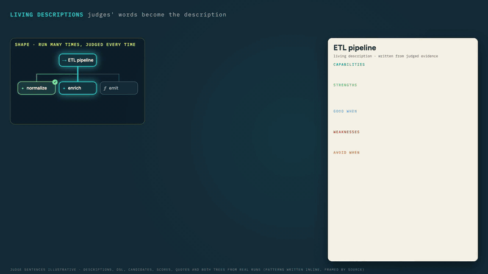
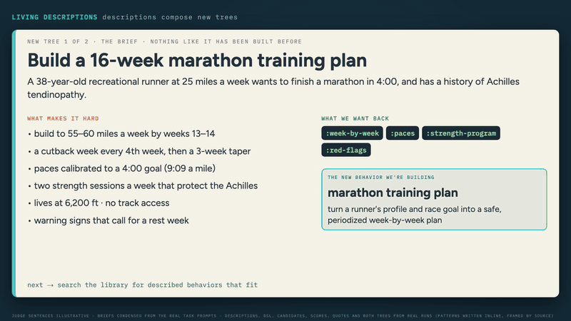

# Living Descriptions — how ORC trees and nodes learn to describe themselves

In the ORC lab, judges don't just score a run; they explain it. **Living Descriptions** turn those explanations into evidence-backed knowledge about every node, tree shape and behavior: what it is good at, when it fails, when to use it and when to avoid it. When a brand-new task arrives, ORC retrieves the descriptions that fit, and the model composes a new tree from them.

<p align="center"></p>
<p align="center"><sub>Judges' feedback becomes evidence-backed claims (strengths, capabilities, good-when, weaknesses, avoid-when) that describe the node. <i>Judge sentences illustrative; claim texts from a real description.</i></sub></p>

> **⚠ Alpha-stage capability.** Living Descriptions work end to end, but how the corpus and the classifier behave on out-of-distribution tasks is still being investigated. See [Honest status today](SELF-IMPROVING-LOOP.md#honest-status-today--solid-vs-rough) for what is solid and what is rough.

This guide is layered: stakeholders read [Part 1](#part-1--the-30-second-story-for-stakeholders), developers using ORC read [Part 2](#part-2--the-developer-mental-model), and implementers read [Part 3](#part-3--implementers-view-architecture--status). For a hands-on introduction to the whole self-improving loop, start with [SELF-IMPROVING-LOOP.md](SELF-IMPROVING-LOOP.md).

## Part 1 — The 30-second story (for stakeholders)

ORC is a laboratory for building AI workflows: they run as **behavior trees** — structured plans of LLM calls, code transforms, parallel branches, and so on — and every execution is recorded and judged. When the same workflow runs many times, the **Living Descriptions** system automatically captures what each tree and node is good at, when it tends to fail, and what to prefer or avoid — building up self-knowledge from real execution evidence, not hand-written docs. A human-authored seed corpus starts the system on day one; as workflows run, descriptions evolve: successes gain confidence and failures get actionable, principle-shaped lessons. When a developer builds a new workflow, the system surfaces relevant prior patterns as design inspiration. The result: ORC gets smarter over time without needing developers to babysit it — see [Part 2](#part-2--the-developer-mental-model) for how.

### Watch it work: two trees nobody had built before

Descriptions only matter if they change what gets built. These are two real benchmark runs (`gemini-3-flash-preview`, with the behavior library switched on via `:auto-classify? true`)), retrieving from ORC's shipped seed descriptions. Neither task's domain appears anywhere in those seeds; only its general shape does.

#### 1 · Scale a ratatouille recipe from 6 plates to 60

<p align="center"></p>
<p align="center"><sub>The brief, the descriptions retrieved for it, and the tree composed from them. <i>Real run; the drill-in on the logistics node is an illustrative breakdown.</i></sub></p>

**The brief.** A restaurant's chef-tested ratatouille feeds 6, and now they're catering for 60. It isn't ×10: a 12-inch pan holds about 6 plates, bigger pots heat unevenly, salt doesn't scale linearly with the vegetables, big batches get over-stirred and mashed, the knife work needs stations, and they need hold times and a cost. Wanted back: `{:scaled-ingredients :revised-technique :workflow :timing :cost-estimate :pitfalls-and-mitigations}`.

**What was retrieved.** The *ETL pipeline* shape (fit 0.95), whose worked pattern is a sequence of stages with named intermediates, and the *Analysis* behavior, whose description says: *"for multi-dimensional analysis, fan out per-dimension `:llm` stages via `:parallel`."*

**What the model said, before writing any tree:**

> *"I am adopting the ETL Pipeline structural pattern … I will also incorporate the Analysis behavioral pattern by using a `:parallel` block to handle orthogonal dimensions like `logistics` (workflow/timing) and `economics` (costing) separately … I rejected a single-pass LLM call because it would likely fail to account for the specific non-linear scaling constraints (like salt ratios and cookware capacity)."*

**The tree it built:**

```clojure
[:sequence
 [:llm      {:writes [:scaled_base]}]   ; scale the recipe: seasoning, batches, cookware
 [:parallel
  [:llm     {:writes [:logistics]}]     ; workflow and timing
  [:llm     {:writes [:economics]}]]    ; costing
 [:code     {:writes [:result]}]]       ; assemble the catering package
```

Without the library, the same model built a two-step tree: one LLM call that did all of it, then a formatting step.

#### 2 · Build a 16-week marathon training plan

<p align="center"></p>
<p align="center"><sub>Same library, different composition: a sequential plan with a critique-and-revise stage. <i>Real run; the drill-in on review &amp; revise is an illustrative breakdown.</i></sub></p>

**The brief.** A 38-year-old recreational runner at 25 miles a week wants a 4:00 marathon and has a history of Achilles tendinopathy. The plan must build to 55–60 miles a week, cut back every 4th week, taper for 3 weeks, calibrate paces to the goal, include Achilles-safe strength work, and account for 6,200 ft altitude with no track. Wanted back: `{:week-by-week :paces :strength-program :red-flags}`.

**What was retrieved.** *ETL pipeline* (fit 0.92) and *Iterative refinement* (draft → critique → revise), whose description says an *"explicit critique stage between draft and revision forces the model to articulate specific defects before fixing them."*

**What the model said:**

> *"I am adopting the ETL (Extract, Transform, Load) pattern combined with Iterative Refinement (draft-critique-revise) … I am skipping the `map-each` pattern for individual weeks because the schedule requires global consistency (e.g., volume ramps and cutback cycles) that is better handled by a model looking at the full timeline."*

**The tree it built:** calibrate paces → draft 16 weeks → review & revise → load.

```clojure
[:sequence
 [:llm  {:writes [:calibrations]}]    ; paces and strength protocol first
 [:llm  {:writes [:draft_plan]}]      ; the full 16-week schedule
 [:llm  {:writes [:final_content]}]   ; critique ramps, cutbacks, Achilles safety; revise
 [:code {:writes [:result]}]]         ; package the requested map
```

Here the model reached a similar shape without the library too; the retrieved descriptions changed its *argument* (what to adopt, what to reject and why) more than its topology.

**Same library, two compositions.** The recipe became a *parallel* fan-out of independent analyses; the marathon became a *sequential* draft-and-refine plan. The model is combining described pieces, not replaying one template.

### What happens next

Each of these runs is itself new evidence. Its judged executions feed the descriptions it drew on (see [How descriptions evolve](#how-descriptions-evolve)), and when nothing in the library fits a task, the model can contribute a new behavior with the `(mint-behavior! ...)` sandbox primitive, which later tasks can retrieve.

**Honest limits.** Retrieved descriptions are prepended to the model's prompt, so they cost tokens and time. On ORC's R-Inject benchmark tasks the overhead ranged from +20% tokens on a large RFP to +657% on a short employment agreement, and wall-clock time roughly doubled or tripled, because the model builds more elaborate trees. The proportional cost is highest on small tasks.

## Part 2 — The developer mental model

If you're building or operating an ORC workflow, here's how to think about Living Descriptions:

### What a description looks like

Every entity — a node type (`:llm`, `:map-each`, etc.), a specific node in a specific workflow, or a tree shape (like "chunked-extraction") — has a description that looks roughly like this:

```clojure
{:capabilities ["chunks large documents", "extracts entities per chunk"]

 :strengths
 [{:trait "bounded :max-concurrency on :map-each over chunks"
   :good-when "input is a large chunked document"
   :recommended-pattern "[:map-each {... :max-concurrency 3} [:llm {...}]]"
   :confidence 0.92
   :evidence-count 45}]

 :weaknesses
 [{:trait "rate-limit exhaustion under unbounded parallelism"
   :avoid-when "input has >6 chunks AND :max-concurrency is unset"
   :recommended-alternative "set :max-concurrency to 3 on the :map-each"
   :confidence 0.6
   :evidence-count 8}]

 :representative-uses ["document-analysis benchmark", "legal-issue-detection"]
 :summary "When extracting from chunked documents, prefer bounded map-each concurrency."
 :version 4
 :consolidated-from-event-count 53}
```

Every strength and weakness is **principle-shaped**: a concrete trait, a context guard (when does it apply?), and actionable advice (a recommended pattern or alternative). Confidence weights the entry — high-confidence entries are surfaced to the model when designing new trees; low-confidence entries are tracked but hidden until evidence accumulates.

> **`:avoid-when` is now enforced, not just stored.** A weakness's `:avoid-when` guard used to be recorded for the model to read; it is now an active signal in classification, closing a loop that previously left judge-grounded evidence the decision layer never consulted (ADRs 0015 / 0016). The loop closes in three steps: the consolidator **learns** `:avoid-when` from judge evidence (this doc) → the classification reranker **reads** each candidate's `:avoid-when` → a deterministic contrastive domain penalty **enforces** it after the rerank, down-weighting a candidate whose avoid-condition the task matches more than its use-case. So a guard a description accrues here directly biases which pattern future tasks retrieve. See [SELF-IMPROVING-LOOP.md § How novelty is handled](SELF-IMPROVING-LOOP.md#2-how-novelty-is-handled--detect-and-defer--the-emergence-loop) and [EVALUATION-COMPONENT.md](EVALUATION-COMPONENT.md).

### Three granularities

| Granularity | What it groups | Example use |
|---|---|---|
| **node-type** | All instances of `:llm` (or `:map-each`, etc.) across all workflows | *"In general, what do `:map-each` nodes tend to do well?"* |
| **node-instance** | One specific node in one specific workflow | *"The 'validator' LLM in my report-generation workflow has been reliable in the last 50 runs."* — [see in action (GETTING-STARTED.md Phase 2)](GETTING-STARTED.md#phase-2--llm-judges) |
| **tree-fingerprint** | Trees with the same structural shape (regardless of content) | *"Chunked-extraction trees with a final synthesizer step work well for medium-large docs."* |

### How descriptions evolve

Descriptions update through three signals:

1. **Hand-authored seeds** — at the start, an initial catalog of ~18 descriptions captures known patterns (the 6 basic node types + the 5 benchmark task classes + 7 generic tree shapes). These are reviewed for quality and ground every claim in real benchmark evidence.
2. **Cold-start LLM baseline** — when a brand-new entity appears (a new node instance, an unfamiliar tree shape), the system asks an LLM to write a low-confidence initial description based on the entity's structural shape. Marked at confidence 0.1 so it's invisible to retrieval until real evidence reinforces it.
3. **Rolling consolidation** — as the system observes execution events (successes, failures, and judge scores from the per-event evaluator runtime — see "Judge integration" below), a periodic reflection step updates the description. Stable patterns climb in confidence; anomalies appear as low-confidence-but-actionable entries; outdated entries decay and eventually auto-archive.

### What protects descriptions from over-reacting to recent runs

Four safeguards keep descriptions stable over time:

1. **Decoupled threshold and window.** Consolidation triggers when ~10 new events accumulate, but each consolidation reads the last 500 events — so a single bad burst doesn't reshape the description.
2. **Aggregate + delta in the prompt.** The reflection LLM sees all-time aggregate metrics alongside the recent window's slice — and is told explicitly: "update only when recent evidence is consistent AND substantial."
3. **Per-entry confidence with demotion-not-deletion.** New consistent evidence climbs an entry's confidence; contradicting evidence reduces it proportionally. Confidence below 0.2 hides the entry from retrieval but keeps it in the description; below 0.05, the entry archives to history.
4. **Anomalies are principle-shaped, not flags.** When recent metrics deviate from historical, the new entry is a low-confidence-but-actionable principle (concrete avoid-when + concrete recommended-alternative). Never "investigate" or "observed" placeholders.

### How developers use this

Most developers won't interact with the system directly — they just write their workflows normally, and the system uses recorded descriptions in two ways:

1. **Pattern injection** — when a repl-researcher runs with `:auto-classify? true` on its `:rlm` config, the top-fitting pattern's full body (capabilities + worked-example DSL snippets + observed strengths and weaknesses) is prepended to the model's instruction before it starts designing the tree.

2. **Cross-task behavioral retrieval** — when the model designs a new tree, behavioral subtrees that match the task's accomplishment shape are surfaced as candidates. The model can adopt, adapt, or — if nothing fits — contribute a new behavior via the `(mint-behavior! ...)` sandbox primitive. Minted behaviors persist for future retrieval across all tasks.

> **LD loop and GEPA are orthogonal.** The Living Description consolidation loop feeds GEPA with per-run score+feedback signal; GEPA is the static-instruction actuator that tunes `:llm` node instruction strings from that signal. Neither requires the other.

For developers who want explicit control:

- Read the current description for any tree-class, behavioral subtree, node-instance, or node-type via `ontology/get-description`.
- Inspect a description's history (`ontology/get-description-history`) to see how the body evolved across consolidation cycles.
- Tune the consolidation threshold per granularity via `:ontology/set-consolidation-threshold` (default 10 events accumulated per target before a reflection cycle fires).
- See [`SELF-IMPROVING-LOOP.md`](SELF-IMPROVING-LOOP.md) for the end-to-end consumer guide with example workflows.

## Part 3 — Implementer's view (architecture + status)

### Architecture

```
EVENT STREAM (existing) — :sheet/node-execution-completed,
  :sheet/rlm-tree-execution-completed, :judge/score-emitted (when judges land)
        ↓
ROLLING AGGREGATOR (extends existing rolling-metrics)
  per-node-instance | per-node-type (cross-sheet) | per-tree-fingerprint
        ↓
CONSOLIDATION TRIGGER (new Grain processor)
  threshold (default 10) OR on-demand
        ↓
CONSOLIDATOR (new todo processor)
  Pulls window=500 recent events + accumulated metrics + structural context.
  Runs a single LLM reflection with structured Malli output.
  Emits the appropriate :ontology/*-description-updated event.
        ↓
ONTOLOGY DESCRIPTION READ MODEL
  Projects events into "current description" + "history" per (granularity, target-id).
        ↓
COLBERT RE-INDEX (C-2b)
  Async; re-indexes the :summary into ColBERT on every *-description-updated.
        ↓
SEMANTIC RETRIEVAL
  Model queries via natural language → ColBERT search → RRF rank-fusion across granularities.
```

### Judge integration (added 2026-06)

The consolidator's reflection input was extended to include judge scores alongside raw execution events. Verified live on `legal-issue-detection` multi-cycle:

- **Per-event evaluator runtime** (`components/evaluation/src/.../core/judge_runtime.clj`) subscribes to `:sheet/node-execution-completed` and requests one durable assessment per attached judge, default or custom. Attaching a judge enables it. The Living Description flag gates only the defaults: when it is on, repl-researcher nodes without an explicit `:judges` get 5 default judges auto-attached: heuristic-structural + grounding + reasoning + completeness + instruction-following.
- **Auditable model evidence** — LLM-authored description updates and rejections
  persist model provenance with the event, including provider/model identity and
  available usage metadata. Replaying events reconstructs the recorded decision;
  it does not silently ask the current model to recreate history.
- **Only learning judges feed this loop.** A judge declares its purposes. A **learning judge** (which must require feedback) emits `:judge/score-emitted` for each scored outcome that carries feedback, and the consolidator reads those. A **monitoring judge**, such as a score-only judge, records assessments and performance but never reaches the consolidator. A failed or ungradable assessment emits no score, so the consolidator never sees an invented one. See [JUDGE-ARCHITECTURE.md](JUDGE-ARCHITECTURE.md) and [`EVALUATION-COMPONENT.md`](EVALUATION-COMPONENT.md#purposes-monitoring-and-learning).
- **The score is derived from a band.** Each `:score` is derived from a described band of the judge's rubric, never reported by the model as a float.
- **Score events** (`:judge/score-emitted`) land in the event store tagged with `[:sheet :tick :node]`.
- **Consolidator joins them** via `gather-recent-tree-class-events`: per-observation `:judge-scores` from the recent window + `:judge-averages` per judge across the target's lifetime in `:aggregate-metrics`.
- **Reflection instruction explains the data**: tells the LLM that `:judge-averages` is the stable baseline and to weight per-tick judge divergence with the same anti-recency discipline as success-rate deltas.
- **Custom judges** plug into the same pipeline via `:type :custom` + `:sheet-id` referencing a consumer-built eval workflow. See [`RLM-GUIDE.md`](RLM-GUIDE.md#judges-on-repl-researcher-nodes-rlm-specific-defaults--living-description-loop).

Composite scoring: once a subject's learning judges have all settled, and there are 2 or more, the runtime emits one `:judge/composite-score-computed` event with the weighted composite of those that scored, its coverage, and `:partial` when any did not score. Default policy: even-weight (1/N) when consumers don't set explicit weights; consumer-set `:judge-config :weight` values normalize to sum to 1.0. The per-judge `:judge-averages` map stays alongside in the consolidator's reflection input — consumers wanting the independent per-judge signal aren't disrupted.

### Capabilities surface

The following capabilities are part of the shipped self-improving loop:

| Capability | What it provides |
|---|---|
| **Hand-authored seed corpus** | Initial body for tree-classes (structural patterns) and behavioral subtrees (accomplishment patterns), shipped with confidence-weighted strengths and weaknesses. |
| **Cold-start description generation** | When a brand-new entity is observed, the system produces a low-confidence initial description so it's tracked from event 1 — invisible to retrieval until evidence accumulates. |
| **Rolling consolidation** | A periodic reflection step reads recent execution events alongside accumulated metrics and emits an updated description. Anti-recency safeguards prevent single-bad-burst overcorrection. |
| **Per-event judges** | Default judges (heuristic-structural, grounding, reasoning, completeness, instruction-following) attach to repl-researcher nodes when the opt-in flag is on. Scores feed the consolidator alongside raw success/failure signal. |
| **Custom judges** | Consumers plug in their own per-task quality criteria as `:type :custom` judges referencing a sheet-id of their own evaluation workflow. |
| **Composite scoring** | When a subject has two or more learning judges, one weighted composite of those that scored is emitted alongside the per-judge scores, with its coverage. Default is even-weight; consumers can set explicit weights that normalize to 1.0. |
| **Behavioral mint affordance** | The recursive RLM sandbox primitive `(mint-behavior! ...)` lets the model contribute a new pattern when none of the existing corpus entries fits at meaningful confidence. The minted behavior persists in the corpus and is retrievable for future tasks. |
| **Classifier API + R-Inject prepend** | `:auto-classify? true` on a repl-researcher's `:rlm` config classifies the task against the corpus and prepends the top-fitting pattern's body to the model's instruction. |
| **Recursive RLM with drill-down** | The model can design a tree, run it, inspect via `(tree-detail)` / `(tree-failures)` / `(node-output ...)`, and emit focused recovery trees when leaves fail — without rebuilding the whole pipeline. |
| **Description-history audit trail** | Every body update is an append-only event; `ontology/get-description-history` returns the chronological sequence of every version with timestamps. |

### Where this fits in the broader ORC architecture

- **Consumer entry point:** [`SELF-IMPROVING-LOOP.md`](SELF-IMPROVING-LOOP.md) — practical guide for developers using the loop in their workflows
- **Recursive RLM reference:** [`RLM-GUIDE.md`](RLM-GUIDE.md) — tree DSL, sandbox primitives, drill-down, sub-LLM costs
- **Storage and event surface:** [`PATTERN-RECORDING.md`](PATTERN-RECORDING.md) — events emitted, read-model projections, query API
- **Continuous-improvement framing:** [`SELF-IMPROVING-LOOP.md`](SELF-IMPROVING-LOOP.md) — consumer guide for the full self-improving loop (see also [`archived/FEEDBACK-LOOP.md`](archived/FEEDBACK-LOOP.md) for the pre-RLM framing)
- **Building behavior trees:** [`ORC-SERVICE-GUIDE.md`](ORC-SERVICE-GUIDE.md) — node types, blackboard schemas, composition
- **Pattern library:** [`CONTRIBUTOR-GRAIN-PATTERNS.md`](contributors/CONTRIBUTOR-GRAIN-PATTERNS.md) — common tree shapes worked-out
