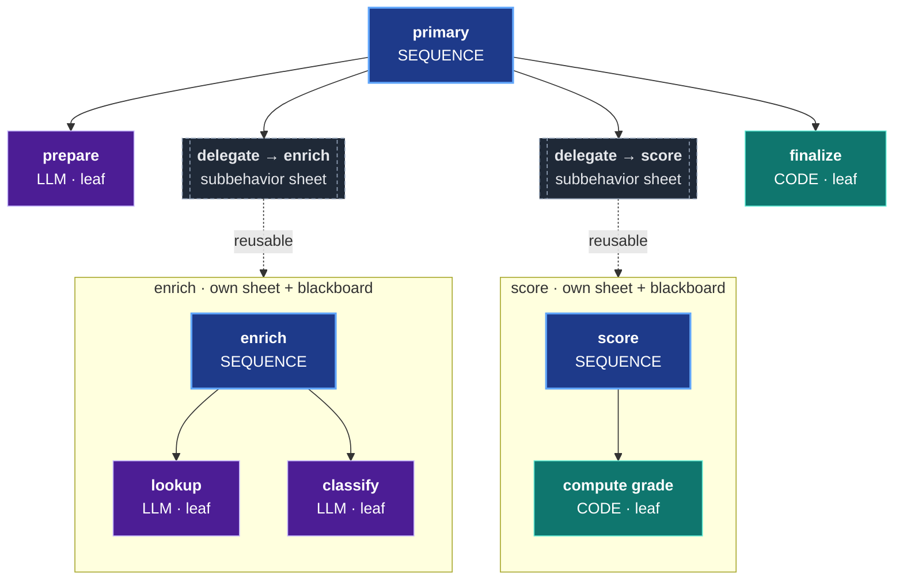
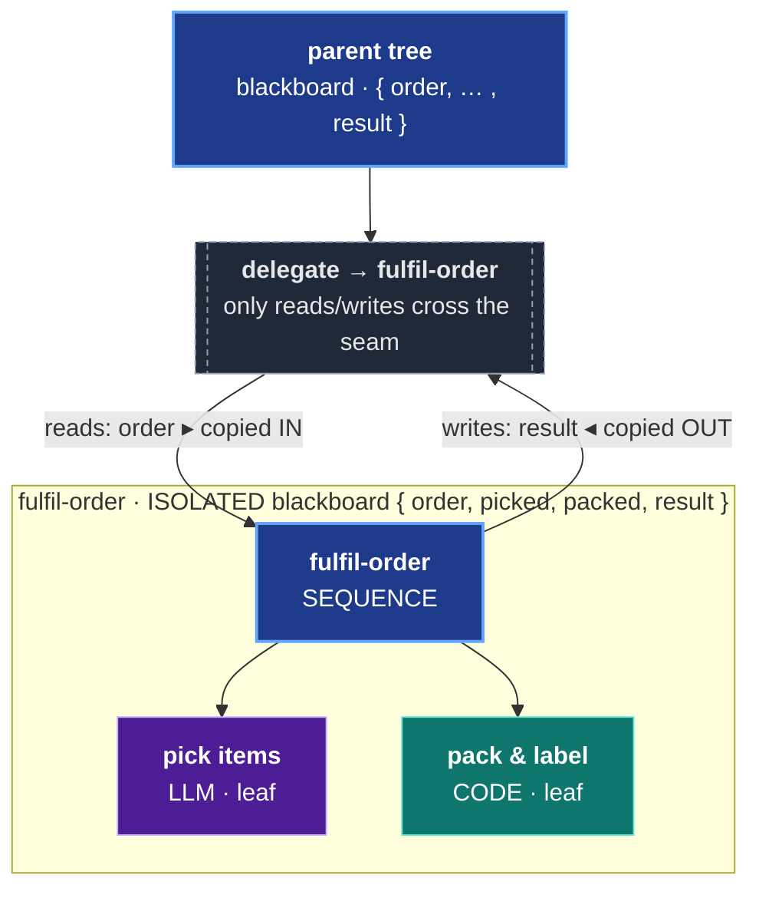
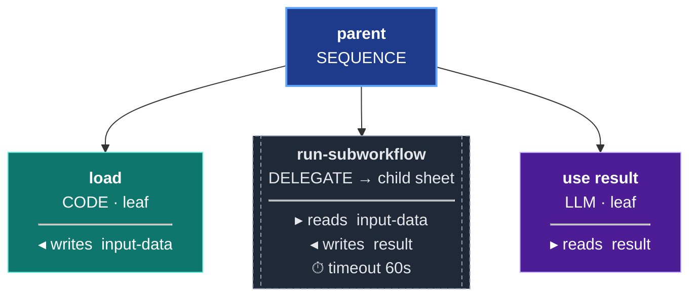

# Sheet Service Guide

A comprehensive guide to the orc-service component, which provides the ORC (Orchestration Runtime for Clojure) behavior tree engine for building and executing AI workflows.

> For a progressive introduction see [GETTING-STARTED.md](GETTING-STARTED.md). This doc is the complete DSL and execution reference.

## You build a workflow by composing nodes into a tree

Everything in ORC starts from one idea: **you build a workflow by composing nodes into a tree.** There is no special "workflow object" to learn — there is a small palette of nodes, and you nest them.

- **Start with a `:sequence` of `:llm` and `:code` nodes.** A sequence runs its children in order; an `:llm` node calls a model; a `:code` node runs a Clojure function. That's a complete, runnable workflow. Most workflows begin exactly here.
- **As your methodology grows, factor reusable pieces into their own sheets and `:delegate` to them.** A step that has become its own little methodology — "summarize a document", "score a candidate", "extract entities" — graduates into its own sheet. Your central tree then `:delegate`s to it. Your primary tree becomes a *composition of subbehaviors* rather than one giant flat list of leaves. This is the same move you make when you extract a function out of a long block of code.
- **When one step is genuinely open-ended, reach for `:repl-researcher`.** Some work can't be laid out as a fixed tree ahead of time — the right shape depends on what the data turns out to be. That's where the exploratory `:repl-researcher` node earns its weight: the model designs (and re-designs) a tree at runtime.

<p align="center"></p>
<p align="center"><sub>A running ORC tree: each node reads and writes typed blackboard keys (the chalkboard); the tree decides what runs next. <i>Illustrative workload, real node kinds.</i></sub></p>

Read the rest of the guide in that order — it goes from simple, to composed, to exploratory, then to the cross-cutting concerns you add on top.

### How to read this guide

1. **Simple trees first.** [Control Nodes](#control-nodes) (`sequence`, `parallel`, `fallback`, `map-each`) and [Leaf Nodes](#leaf-nodes) (`llm`, `code`, `condition`, `llm-condition`). Compose these and you can already build real workflows.
2. **Composition next.** [`delegate`](#delegate) is how you compose reusable subbehaviors into a primary tree — the heart of how ORC workflows grow. See ORC-PRINCIPLES Principles 2–3.
3. **The heavy exploratory node.** [`repl-researcher`](#repl-researcher) for genuinely open-ended steps. Powerful, but reach for it only when a fixed tree truly can't express the work.
4. **Cross-cutting concerns, each gated by an opt-in layer.** [Judges](#attaching-judges-to-nodes) (Layer 1 — needs `evaluation`), [GEPA optimization](#gepa-integration) (Layer 3 — needs `gepa` + `evaluation`), and [live streaming](STREAMING.md). These layer *on top of* a working tree; you add them when you need them, never to get started.

> **New here?** Walk [GETTING-STARTED.md](GETTING-STARTED.md) first — it's the gentle, hand-held on-ramp that builds your first tree step by step. Come back here for the full node palette. For the exhaustive, every-option-listed node reference, see [DSL-REFERENCE.md](DSL-REFERENCE.md).

## Table of Contents

1. [Overview](#overview)
2. [Quick Start](#quick-start)
3. [Workflow DSL Reference](#workflow-dsl-reference)
4. [Blackboard Patterns](#blackboard-patterns)
5. [Execution Model](#execution-model)
6. [Event Store Integration](#event-store-integration)
7. [Code Executors](#code-executors)
8. [Testing Workflows](#testing-workflows)
9. [GEPA Integration](#gepa-integration)
10. [API Reference](#api-reference)

---

## Overview

> **Layer 0** — `orc-service` only, no Python. See [COMPONENT-MAP.md](COMPONENT-MAP.md).

The orc-service component is the core of ORC's behavior tree execution engine. It provides:

- **Declarative Workflow DSL** - Define AI workflows as composable data structures
- **Event-Sourced Persistence** - All workflow definitions and executions are stored as events
- **Behavior Tree Semantics** - Industry-standard control flow (sequence, parallel, fallback)
- **Integrated LLM Execution** - First-class support for LLM nodes
- **Comprehensive Tracing** - Full observability of every execution

### Architecture

```
┌─────────────────────────────────────────────────────────────────┐
│                         orc-service                            │
├─────────────────────────────────────────────────────────────────┤
│  interface.clj                                                   │
│  ├── Workflow DSL (workflow, blackboard, sequence, llm, ...)   │
│  ├── Execution (execute, build-workflow!)                       │
│  └── Queries (get-sheet, get-nodes-for-sheet, get-trace)       │
├─────────────────────────────────────────────────────────────────┤
│  core/                                                           │
│  ├── dsl.clj          - DSL builder functions                  │
│  ├── commands.clj     - Event-sourced command handlers          │
│  ├── runtime.clj      - Behavior tree traversal                 │
│  ├── executor.clj     - Node execution (AI + code)              │
│  ├── read_models.clj  - Event projections & queries             │
│  └── gepa.clj         - GEPA prompt optimization                │
└─────────────────────────────────────────────────────────────────┘
```

---

## Quick Start

### Minimal Workflow

```clojure
(ns my-app.workflows
  (:require [ai.obney.orc.orc-service.interface :as sheet]))

;; 1. Define a workflow
(def hello-workflow
  (sheet/workflow "hello-world"
    (sheet/blackboard
      {:name :string
       :greeting :string})

    (sheet/llm "greet"
      :model "google/gemini-2.0-flash-001"
      :instruction "Generate a friendly greeting for the given name."
      :reads [:name]
      :writes [:greeting])))

;; 2. Build the workflow (stores in event store)
(def sheet-id (sheet/build-workflow! ctx hello-workflow))

;; 3. Execute with inputs
(def result (sheet/execute ctx sheet-id {:name "Alice"}))

;; 4. Check outputs
(:status result)   ;; => :success
(:outputs result)  ;; => {:greeting "Hello Alice! ..."}
```

### Running in the REPL

```clojure
;; Load development context (see development/src/repl_stuff.clj)
;; This gives you: ctx, event-store, service

;; Build and execute
(def sheet-id (sheet/build-workflow! ctx my-workflow))
(sheet/execute ctx sheet-id {:input "value"})
```

---

## Workflow DSL Reference

> **Layer 0** — `orc-service` only, no Python. See [COMPONENT-MAP.md](COMPONENT-MAP.md).

### `workflow`

Create a named workflow container.

```clojure
(sheet/workflow "my-workflow-name"
  (sheet/blackboard {...})
  (sheet/sequence "main"
    ...))
```

The workflow name is used to generate a deterministic UUID v5, so rebuilding the same workflow produces the same sheet-id. A SHA-256 content hash is stored on each build — if the definition hasn't changed, `build-workflow!` is a true no-op (zero events emitted). This makes it safe to call on every application startup.

### `blackboard`

Define typed shared state using Malli schemas.

```clojure
(sheet/blackboard
  {:input-text :string
   :word-count :int
   :items [:vector :string]
   :analysis [:map
              [:score :double]
              [:reasoning :string]]})
```

### Control Nodes

#### `sequence`

Execute children in order. Fails immediately if any child fails.

```clojure
(sheet/sequence "main-flow"
  (sheet/code "step-1" ...)
  (sheet/llm "step-2" ...)
  (sheet/code "step-3" ...))
```

#### `parallel`

Execute children concurrently.

```clojure
(sheet/parallel "concurrent-work"
  :success-policy :all    ;; :all (default) or :any
  :failure-policy :any    ;; :any (default) or :all
  (sheet/llm "task-a" ...)
  (sheet/llm "task-b" ...)
  (sheet/llm "task-c" ...))
```

#### `fallback`

Try children until one succeeds (selector pattern).

```clojure
(sheet/fallback "try-options"
  (sheet/code "try-cache" ...)
  (sheet/llm "try-llm" ...)
  (sheet/code "use-default" ...))
```

#### `map-each`

Iterate over a collection.

```clojure
(sheet/map-each "process-items"
  :collection-key :items
  :item-key :current-item
  :result-key :processed-items
  :parallel 3               ;; Optional parallelism
  (sheet/llm "process" ...))
```

> **Parallel-safety — the leaf must be a primitive.** `map-each` collects each iteration from the
> leaf's **explicit `:writes`, isolated per iteration** — that's what makes `:parallel` safe. A
> **composite** leaf (`fallback`/`sequence`) completes with *empty* parent writes, so the engine
> instead reads **all non-special keys off the per-iteration blackboard**; under `:parallel` that
> **scrambles results across items**, and even sequentially a key written by only one branch
> **bleeds** to later items. Keep a parallel `map-each` leaf a **primitive** (`llm`/`code`) with
> explicit `:writes`; do **not** wrap it in a `fallback` whose writes you depend on. On a leaf
> failure the engine isolates it — status `:partial`, the failed item **dropped and the result
> vector compacted** (no index gap), and top-level `:failure-indices` is nil — so recover *which*
> item failed from the event/trace channel and re-run/surface it at the parent (never ship a
> compacted partial as complete). See ORC-PRINCIPLES Principle 14.

With checkpoint recovery enabled, a one-level `map-each` resumes the original
tick from durable per-item execution contexts. Completed items are rejoined,
started-but-incomplete items are resumed, and only never-started pending items
are newly dispatched. Result order and partial-failure evidence follow the
declared item indices rather than completion order. The coordinator held in
memory is only a cache and overlapping recovery scans cannot replace newer
completion state with an older snapshot. Nested `map-each` recovery is not yet
supported: its identity requires a stacked occurrence context rather than the
current single parent/index pair.

### Leaf Nodes

#### `llm`

Call an LLM.

```clojure
(sheet/llm "analyze"
  :model "google/gemini-2.0-flash-001"
  :instruction "Analyze the input and provide insights."
  :reads [:input-data]
  :writes [:analysis])
```

**Options:**

| Option | Description |
|--------|-------------|
| `:model` | LLM model identifier (OpenRouter format) |
| `:instruction` | System prompt for the LLM |
| `:reads` | Vector of blackboard keys to read as input |
| `:writes` | Vector of blackboard keys to write as output |
| `:temperature` | Sampling temperature (default: 0.7) |

#### `code`

Execute a Clojure function.

```clojure
(sheet/code "transform"
  :fn "my-app.executors/transform-data"
  :reads [:input]
  :writes [:output])
```

#### `condition`

Check a boolean expression on the blackboard.

```clojure
(sheet/condition "check-valid"
  :check {:key :valid? :op :equals :value true})  ;; True when :valid? blackboard key is true
```

#### `llm-condition`

Use an LLM for yes/no decisions.

```clojure
(sheet/llm-condition "is-spam"
  :model "google/gemini-2.0-flash-001"
  :question "Is this message spam?"
  :reads [:message])
```

#### `delegate`

**This is how you compose subbehaviors into a primary tree.** `:delegate` executes another workflow (a separate sheet, with its own isolated blackboard) as a node inside the current tree. When a step in your workflow has grown into its own little methodology, you factor it into its own sheet and `:delegate` to it — and your central tree becomes a *composition of subbehaviors* rather than one flat list of leaves. This is the same instinct as extracting a function: the subbehavior is durable, independently testable, independently optimizable, and reusable across many parent trees. See ORC-PRINCIPLES [Principle 2 — *Compose complex behavior as durable, delegatable subtrees*](ORC-PRINCIPLES.md#2-compose-complex-behavior-as-durable-delegatable-subtrees) and [Principle 3 — *`:delegate` is the composition mechanism*](ORC-PRINCIPLES.md#3-delegate-is-the-composition-mechanism).

A primary tree composing two reusable subbehaviors via `:delegate`:



Each `:delegate` is a clean seam — the child runs against its own isolated blackboard, and only the declared `:reads`/`:writes` cross the boundary:



Execute another workflow with isolated blackboard.

```clojure
(sheet/delegate "run-subworkflow"
  :target-sheet-id child-sheet-uuid
  :reads [:input-data]           ;; Pass to child
  :writes [:result]              ;; Receive from child
  :timeout-ms 60000)             ;; Optional timeout
```



**Options:**

| Option | Description |
|--------|-------------|
| `:target-sheet-id` | UUID of the workflow to execute |
| `:reads` | Blackboard keys to pass as inputs |
| `:writes` | Blackboard keys to receive as outputs |
| `:timeout-ms` | Execution timeout (default: 300000ms) |
| `:inherit-ontology?` | Share ontology context (default: true) |

> **Map-parsing across the seam (Principle 10).** `:delegate` passes values **verbatim** — values are not type-coerced. Whether a map contract arrives parsed (vs. as a JSON string) depends on the **producing node type**: an `:llm` node produces a JSON string unless you declare a structured `[:map …]` Malli schema on the blackboard key; a `:code` node returns native Clojure, so maps arrive parsed naturally; a `:repl-researcher` node finalizes with real EDN (parsed) when prompted to emit a Clojure map. Declare structural Malli schemas on keys that cross the seam. See [ORC-PRINCIPLES.md § Principle 10](ORC-PRINCIPLES.md).

#### `repl-researcher`

Execute a two-phase recursive research loop. In Phase 1 the model inspects the task context and emits a behavior tree DSL. In Phase 2 that tree runs against the sandbox. In recursive mode (the default) Phase 2 outputs are merged back into the sandbox and control returns to Phase 1 — the model can iterate, drill down, emit follow-up trees, and call `(final! ...)` to terminate.

```clojure
(sheet/repl-researcher "researcher"
  :model "google/gemini-2.5-flash"
  :instruction "Research the topic and produce a structured analysis."
  :reads  [:input-data]
  :writes [:research-result]
  :rlm    {:recursive? true})   ;; recursive is the default; omit for same effect
```

> **Recursive and checkpointed are the defaults.** `:rlm true`, `:rlm {}`, and `:rlm {:debug? true}` select recursive mode and durable per-iteration checkpointing. Use `:checkpointed? false` only for the legacy single-invocation path. Terminal mode (`:rlm {:recursive? false}`) remains non-checkpointed when the checkpoint key is omitted and is **deprecated** — preserved for backward compatibility; migrate by dropping the `:recursive? false` key.

**Options:**

| Option | Description |
|--------|-------------|
| `:model` | LLM model identifier (OpenRouter format) |
| `:instruction` | Task instruction for the researcher's Phase 1 |
| `:reads` | Blackboard keys passed to the Phase 1 context |
| `:writes` | Blackboard keys to receive from `(final! ...)` |
| `:rlm` | RLM config map, or `true` for defaults (recursive mode) |

See [RLM-GUIDE.md](RLM-GUIDE.md) for the complete recursive-mode reference, drill-down primitives (`tree-detail`, `tree-failures`, `node-output`), budget controls, and how to compose `:repl-researcher` inside a larger tree.

---

## Blackboard Patterns

### LLM Output Schemas

**Unconstrained blackboard schemas are forbidden, including nested positions.**

Workflow construction fails before creating authoring state when any blackboard
key contains `:any`, `:some`, a standalone or fieldless map, or a collection
without a specific item/value schema. The error identifies the offending key
and exact schema path, then directs the consumer to use the most specific schema
possible for the value's intent.

LLMs need explicit field structure to generate reliable outputs.

#### Bad Pattern (returns nulls)

```clojure
;; DON'T DO THIS
(sheet/blackboard
  {:analysis [:map]})
```

#### Good Pattern (explicit fields + descriptions)

```clojure
;; DO THIS — each field is explicit AND carries a :description.
;; The explicit structure gives the LLM a reliable output shape;
;; the descriptions tell it what each field means. Both matter:
;; structure prevents nulls, descriptions improve field quality.
(sheet/blackboard
  {:analysis [:map
              [:score      [:double {:description "Overall fit score from 0.0 (poor) to 1.0 (excellent)"}]]
              [:reasoning  [:string {:description "Step-by-step justification for the score, written before the score is decided"}]]
              [:keyFactors [:vector {:description "The 3-5 factors that most influenced the score"} :string]]]})
```

Describe **every** key you care about — top-level keys and nested fields alike.
A field with a description consistently produces better output than the same field
without one, because the description is injected into the LLM's output signature
(see [Field Descriptions](#field-descriptions) below).

### Field Descriptions

Add semantic hints using Malli's `:description` property:

```clojure
(sheet/blackboard
  {:question [:string {:description "The user's question to answer"}]
   :answer [:string {:description "A concise, factual answer"}]})
```

Descriptions are included in LLM prompts:

```
Your output fields are:
- answer: A concise, factual answer (string)
```

### Nested Map Schemas

Descriptions work at every level of nesting — describe the nested fields too:

```clojure
(sheet/blackboard
  {:student-analysis
   [:map
    [:academicStrengths [:vector {:description "Subjects/skills the student excels at"} :string]]
    [:careerInterests   [:vector {:description "Career fields the student has expressed interest in"} :string]]
    [:preferenceWeights [:map
                         [:costSensitivity   [:double {:description "How much cost matters, 0.0-1.0"}]]
                         [:locationPreference [:double {:description "How much location matters, 0.0-1.0"}]]]]]})
```

---

## Execution Model

> **Layer 0** — `orc-service` only, no Python. See [COMPONENT-MAP.md](COMPONENT-MAP.md).

### Execution Flow

```
sheet/execute(ctx, sheet-id, inputs)
       │
       ▼
┌──────────────────────┐
│ 1. Load Sheet from   │
│    Event Store       │
└──────────┬───────────┘
           ▼
┌──────────────────────┐
│ 2. Initialize        │
│    Blackboard        │
└──────────┬───────────┘
           ▼
┌──────────────────────┐
│ 3. Traverse Tree     │──► Events: :sheet/tree-tick-started
│    (BFS/DFS)         │              :sheet/node-execution-started
└──────────┬───────────┘              :sheet/node-execution-completed
           ▼
┌──────────────────────┐
│ 4. Execute Nodes     │
│    (AI or Code)      │
└──────────┬───────────┘
           ▼
┌──────────────────────┐
│ 5. Assemble Trace    │──► Event: :sheet/execution-traced
│    Refresh if newer  │    Later: :sheet/execution-trace-refreshed
└──────────┬───────────┘
           ▼
┌──────────────────────┐
│ 6. Return Result     │
│    {:status :outputs │
│     :duration-ms     │
│     :trace-id}       │
└──────────────────────┘
```

### Execution Result

```clojure
(def result (sheet/execute ctx sheet-id {:input "value"}))

result
;; => {:status :success           ;; :success, :failure, :timeout
;;     :outputs {:key "value"}    ;; Final blackboard state
;;     :duration-ms 1234          ;; Total execution time
;;     :trace-id #uuid "..."}     ;; Unique trace identifier
```

### Node Status Semantics

| Status | Meaning |
|--------|---------|
| `:success` | Node completed successfully |
| `:failure` | Node failed (may trigger fallback) |
| `:running` | Node still executing (async) |

### LLM Call Budget (Opt-in)

Prevent runaway workflows in nested iteration scenarios by setting an LLM call limit.

**IMPORTANT:** Budget is opt-in only. If not specified, **no limit is enforced**.

```clojure
;; No budget (default - unlimited)
(sheet/execute ctx sheet-id inputs)

;; With budget (fails if exceeded)
(sheet/execute ctx sheet-id inputs :llm-call-budget 100)
```

**When budget is exceeded:**
- Workflow fails with error: `"LLM call budget exceeded: 100/100"`
- No partial results - fails immediately when limit reached

**When to use:**
- `map-each` over large collections calling LLMs
- Recursive/iterative workflows (repl-researcher)
- Production safety nets for untested workflows

**Tracking:**
- Budget is per-tick (per execution)
- Counter cleared automatically on completion
- Only AI executor calls count (not code nodes)

### Restart recovery

If a process stops after a leaf start was persisted but before its completion,
restart the Grain processors against the same event store and call:

```clojure
(sheet/resume-in-progress! ctx)
;; => [{:tick-id tick-id
;;      :sheet-id sheet-id
;;      :node-id node-id
;;      :original-start-event-id event-id
;;      :resumed? true
;;      :command-result {...}}
;;     ...]
```

The runtime reconstructs active leaf frontiers from durable state. It never
re-enqueues a completed node, and each recovery start references the abandoned
start event. Repeated calls are idempotent. Recovery preserves the existing
tick/node identities rather than creating a replacement execution.

**Recovery only resumes abandoned work.** Every leaf and delegate start carries a
durable ownership lease (`:lease-owner`, `:lease-expires-at`), from the moment it is
recorded — including while it is still queued. The worker running it renews the
lease (`:sheet/node-execution-lease-renewed`) for as long as the work runs. Recovery —
your call, the automatic startup scan, or the 30-second periodic scan — resumes a start
only once its latest lease has expired and the recovering worker is not itself running
it. A healthy long-running leaf is therefore never invoked a second time, whether one
process or several share the event store. A resumed start is leased in turn, so work
whose resumer also dies stays recoverable; each start is resumed at most once.

Configure through the context (both have production defaults):

| Key | Default | Meaning |
| --- | --- | --- |
| `:orc/instance-id` | one random UUID per process | this worker's identity |
| `:orc/execution-lease-ms` | `90000` | lease length; renewed every third |

After a crash, recovery resumes the dead worker's work once its lease lapses (at most
one lease length later). Starts recorded before leases existed count as expired.

This is distinct from reconnecting to `execute-stream`: streams are ephemeral,
while `resume-in-progress!` resumes durable execution work.

---

## Event Store Integration

> **Layer 0** — `orc-service` only, no Python. See [COMPONENT-MAP.md](COMPONENT-MAP.md).

The orc-service uses Grain's event store for persistence and observability.

### Events Emitted

| Event Type | When Emitted | Body Fields |
|------------|--------------|-------------|
| `:sheet/sheet-created` | `build-workflow!` (first build only) | `:sheet-id`, `:name` |
| `:sheet/node-created` | `build-workflow!` (first build or change) | `:sheet-id`, `:node-id`, `:type` |
| `:sheet/key-declared` | `build-workflow!` (first build or change) | `:sheet-id`, `:key-name`, `:schema` |
| `:sheet/content-hash-set` | `build-workflow!` (first build or change) | `:sheet-id`, `:content-hash` |
| `:sheet/tree-tick-started` | `execute` start | `:sheet-id`, `:tick-id` |
| `:sheet/node-execution-started` | Node begins | `:sheet-id`, `:node-id`, `:tick-id` |
| `:sheet/node-execution-completed` | Node ends | `:sheet-id`, `:node-id`, `:status`, `:duration-ms` |
| `:sheet/tree-tick-completed` | `execute` end | `:sheet-id`, `:tick-id`, `:root-status` |
| `:sheet/execution-traced` | Singular trace-creation fact at execution end | `:trace-id`, `:sheet-id`, optional `:correlation-id`, structural lineage, `:status`, `:duration-ms`, `:source-event-count`, profile snapshots, and node trace instances |
| `:sheet/execution-trace-refreshed` | Strictly newer durable evidence revises the canonical trace | Same trace payload as creation, with a greater `:source-event-count` |
| `:sheet/execution-value-written` | A canonical blackboard write | Inline `:value`, or `:value-reference` when file-store mode is configured |

### Tracing, correlation, and exact node I/O

Every tick becomes one trace. Every node start within it has its own
`:trace-instance-id`, so repeated or concurrent runs of the same node are not
ambiguous. `:parent-trace-instance-id` records the node execution tree.

Trace lineage and operation correlation solve different problems:

- `:root-trace-id` and `:parent-trace-id` connect a root tick to delegate and
  generated child ticks.
- `:correlation-id` is a caller-supplied UUID that groups all traces for one
  larger operation, even when that operation launches multiple independent
  roots.

Specify correlation once when execution begins. An explicit execute option has
precedence over the context value; descendants inherit it automatically.

```clojure
(def operation-id (random-uuid))

;; Associate it with a context reused by several independent executions.
(def operation-ctx (assoc ctx :orc/correlation-id operation-id))

(sheet/execute operation-ctx sheet-a inputs-a)
(sheet/execute operation-ctx sheet-b inputs-b)

;; Or override it for one call.
(sheet/execute ctx sheet-a inputs-a :correlation-id operation-id)
```

The tracing queries are query maps dispatched through the ORC query registry.
They return their data under `:query/result`:

```clojure
{:query/name :sheet/get-trace
 :trace-id trace-id}
;; => {:query/result {:trace {...}}}

{:query/name :sheet/get-trace-family
 :trace-id any-family-member}
;; => {:query/result {:root-trace-id ... :traces [...]}}

{:query/name :sheet/get-correlated-traces
 :correlation-id operation-id}
;; => {:query/result {:correlation-id ... :traces [...] :families [...]}}

{:query/name :sheet/node-trace-detail
 :trace-id trace-id
 :trace-instance-id trace-instance-id}
;; => {:query/result {:node-id ... :trace-instance-id ...
;;                    :exec-context ... :inputs {...} :outputs {...}
;;                    :rejected-outputs {...}
;;                    :failure-kind :schema-validation-failed
;;                    :provider-evidence
;;                    {:provider "openrouter"
;;                     :model "provider/model"
;;                     :response-id "..."
;;                     :finish-reason "length"
;;                     :tool-call-present? true
;;                     :tool-call-name "submit_response"
;;                     :usage {...}
;;                     :output-truncated? true}}}
```

`get-trace` returns shape and profiles, not raw values. Select the exact
`:trace-instance-id` from its `:node-traces`, then use `node-trace-detail` to
rehydrate that instance's inputs and outputs from the canonical value log. This
also works when canonical values use file-store references. The node's
instruction is part of the workflow version/draft snapshot used by the trace;
use its `:node-id` with that definition when explaining the prompt that ran.
For failed structured LLM nodes, `:failure-kind` distinguishes transport,
missing forced-tool-call, tool-argument parsing, schema validation, and empty
response failures. `:provider-evidence` is intentionally allowlisted: it does
not expose tool arguments, provider headers, or arbitrary provider payloads.

See [Value Storage](VALUE-STORAGE.md) for inline and external value placement.

### Read Model Queries

```clojure
;; Get sheet metadata
(sheet/get-sheet event-store sheet-id)
;; => {:id sheet-id :name "my-workflow" :created-at ...}

;; Get all nodes for a sheet
(sheet/get-nodes-for-sheet event-store sheet-id)
;; => [{:id node-id :type :leaf :name "step-1" :reads [...] :writes [...]} ...]

;; Get blackboard schema
(sheet/get-blackboard-by-key event-store sheet-id)
;; => {:input {:schema :string} :output {:schema [:map ...]}}

;; Contributor-only read-model access (not the public query envelope)
(sheet/get-trace ctx trace-id)
;; => {:trace-id ... :node-traces [...] :input-snapshot ... :output-snapshot ...}

(sheet/get-traces-for-sheet ctx sheet-id)
;; => [{:trace-id ... :status :success ...} ...]

;; Consumer-facing queries use the query maps documented above and return
;; {:query/result ...}.
```

### Rolling Metrics

Track node performance over a sliding window:

```clojure
;; Metrics for a specific node
(sheet/get-node-rolling-metrics event-store sheet-id node-id)
;; => {:execution-count 150
;;     :success-rate 0.967
;;     :avg-duration-ms 423.5
;;     :recent-trend :stable}  ;; :improving, :degrading, :stable

;; Metrics for all nodes in a sheet
(sheet/get-tree-rolling-metrics event-store sheet-id)
;; => {:sheet-id ... :nodes [{:node-id ... :success-rate ...}] :total-executions 500}
```

### Querying Events Directly

**IMPORTANT:** `es/read` returns a reducible collection that must be materialized with `(into [] ...)` before calling `count` or other sequence functions.

```clojure
(require '[ai.obney.grain.event-store-v3.interface :as es])

;; Query events by type and tags
(into [] (es/read event-store
           {:tenant-id tenant-id
            :types #{:sheet/node-execution-completed}
            :tags #{[:sheet sheet-id]}
            :limit 100
            :reverse? true}))
```

See [EVENT-STORE-PATTERNS.md](./EVENT-STORE-PATTERNS.md) for detailed query patterns.

---

## Code Executors

> **Layer 0** — `orc-service` only, no Python. See [COMPONENT-MAP.md](COMPONENT-MAP.md).

Code nodes execute Clojure functions. The function receives an inputs map and returns an outputs map.

### Basic Executor

```clojure
(defn my-executor
  [{:keys [inputs]}]
  (let [input-val (:input-key inputs)]
    {:output-key (process input-val)}))
```

### Full Context

Executors receive the full execution context:

```clojure
(defn advanced-executor
  [{:keys [inputs context node-id sheet-id]}]
  ;; inputs: map of blackboard keys → values
  ;; context: Grain context with :event-store
  ;; node-id: UUID of this node
  ;; sheet-id: UUID of the workflow
  {:result (compute inputs)})
```

### Registering Executors

Reference executors by fully-qualified function name:

```clojure
(sheet/code "process"
  :fn "my-app.executors/my-executor"
  :reads [:input]
  :writes [:output])
```

---

## Testing Workflows

> **Layer 0** — `orc-service` only, no Python. See [COMPONENT-MAP.md](COMPONENT-MAP.md).

### Test Context Setup

Use `with-async-test-context` for tests that need full event flow:

```clojure
(ns my-app.workflow-test
  (:require [clojure.test :refer [deftest testing is]]
            [ai.obney.orc.orc-service.test-helpers :as h]
            [ai.obney.orc.orc-service.interface :as sheet]))

(deftest my-workflow-test
  (testing "workflow executes correctly"
    (h/with-async-test-context [ctx]
      ;; Create workflow using test helpers
      (let [sheet-result (h/run-and-apply! ctx (h/make-create-sheet-command :name "Test"))
            sheet-id (-> sheet-result :command-result/events first :sheet-id)]

        ;; ... add nodes, execute, verify
        ))))
```

### Mock Executors

Create deterministic executors for testing:

```clojure
(defn mock-qa-executor
  [{:keys [inputs]}]
  (let [question (:question inputs)
        instruction (:instruction inputs)]
    {:answer (str "Mock answer for: " question)}))
```

### Verifying Events

```clojure
(deftest events-test
  (h/with-async-test-context [ctx]
    (let [{:keys [sheet-id]} (create-workflow! ctx)
          event-store (:event-store ctx)

          ;; Execute
          result (sheet/execute ctx sheet-id {:input "test"})

          ;; Query events (must materialize!)
          events (into [] (es/read event-store
                           {:tenant-id (:tenant-id ctx)
                            :types #{:sheet/node-execution-completed}
                            :tags #{[:sheet sheet-id]}}))]

      (is (= :success (:status result)))
      (is (>= (count events) 1)))))
```

### Judges Without a Model in Tests

Assessments run the judge as a workflow, so test them by stubbing the provider seam with `with-redefs` on `llm/predict`, or by using a deterministic custom judge workflow (see [Building a custom judge](#building-a-custom-judge)). `judges/*use-mock-llm*` and `judges/with-mock-llm` only affect the retained synchronous functions such as `evaluate-single`; they have no effect on assessments. `components/evaluation/test/ai/obney/orc/evaluation/docs_examples_test.clj` shows both approaches running.

---

## Attaching Judges to Nodes

> **Layer 1** — requires `evaluation` component. See [COMPONENT-MAP.md](COMPONENT-MAP.md), [EVALUATION-COMPONENT.md](EVALUATION-COMPONENT.md) and [JUDGE-ARCHITECTURE.md](JUDGE-ARCHITECTURE.md).

A **judge** is a behaviour that grades an **assessment subject**, one completed execution of a node, against a **rubric**. Each judgment is a durable **assessment** that ends scored, failed or ungradable. The judge system is **general**: a judge attaches to any node (leaf, composite, delegate or the root), and attaching it enables it. No flag has to be turned on. The 5 default judges that `:repl-researcher` nodes get when the Living Description flag is on are covered in [`RLM-GUIDE.md`](RLM-GUIDE.md#judges-on-repl-researcher-nodes-rlm-specific-defaults--living-description-loop). Every code block marked `;; docs-example: <id>` in this section is run by `components/evaluation/test/ai/obney/orc/evaluation/docs_examples_test.clj`.

### Declare and attach in the DSL

```clojure
;; docs-example: built-in-judge
(def triage
  (sheet/workflow "docs-ticket-triage"
    (sheet/blackboard {:ticket-message :string :category :string})
    (sheet/judges {:grounded {:type :grounding
                              :purposes #{:monitoring :learning}}})
    (sheet/llm "classify"
      :instruction "Classify the ticket into one category."
      :reads [:ticket-message]
      :writes [:category]
      :judges ["grounded"])))

(defn run-triage [ctx]
  (let [sheet-id (sheet/build-workflow! ctx triage)]
    (sheet/execute ctx sheet-id {:ticket-message "URGENT: billing error on my account."})
    sheet-id))

(defn scored-assessments [ctx sheet-id]
  (evaluation/get-assessments ctx {:sheet-id sheet-id :status :scored}))
```

### Declare and attach with commands

The DSL builds these commands for you. You can issue them directly. `:sheet/set-node-judges` accepts any node type.

```clojure
;; docs-example: attach-by-command
(defn declare-and-attach! [ctx sheet-id node-id]
  (doseq [command [{:command/name :sheet/declare-judge
                    :sheet-id sheet-id
                    :judge-name "my-grounding"
                    :judge-config {:type :grounding}}
                   {:command/name :sheet/set-node-judges
                    :sheet-id sheet-id
                    :node-id node-id
                    :judges ["my-grounding"]}]]
    (cp/process-command
     (assoc ctx :command (assoc command
                                :command/id (random-uuid)
                                :command/timestamp (time/now))))))
```

### Judge types

| Type | What it grades |
|---|---|
| `:grounding` | whether claims are supported by what the node read |
| `:instruction-following` | whether the output follows the instruction |
| `:reasoning` | whether the reasoning is sound |
| `:completeness` | whether the output covers every required aspect |
| `:heuristic-structural` | deterministic: the shape of `:writes :generated-tree-raw` if present |
| `:custom` | a consumer-defined workflow, see below |

The four built-in model judges ship as workflows with a default rubric of five described bands, an adversarial stance and the feedback form (reasoning, evidence lists, band, feedback). Declare your own `:rubric` to change the criterion, stance or bands, or `:feedback :none` for a score-only judge. See [EVALUATION-COMPONENT.md](EVALUATION-COMPONENT.md#rubrics-and-bands).

### Purposes

A judge's `:purposes` is a subset of `#{:monitoring :learning}`. A **monitoring judge**'s results describe performance and may carry no feedback. A **learning judge**'s scored results also reach Living Descriptions, harvest and instruction optimization through `:judge/score-emitted`, so it must require feedback. Without `:purposes` a judge serves both, or only monitoring when its rubric has `:feedback :none`.

### When judges run

When a node completes, the evaluation runtime requests one assessment per attached judge, durably, before any judging starts. The judge then runs as a workflow, with a 60 second default deadline (`:timeout-ms`). Delivering the same completion again never creates a second assessment. Repeated executions of one node (a `map-each`, for example) are separate subjects, so three iterations give three assessments. A judge's model is its declared `:model`, otherwise the runtime provider. If neither resolves, the assessment fails with `:judge-model-unresolved`.

### Building a custom judge

A custom judge is a separate workflow that grades the subject. Its blackboard declares the evidence it wants. The runtime always has `:host-inputs`, `:host-outputs` and `:host-instruction` to give it, plus `:rubric` and `:original-task` when declared, and the opt-in `:host-family` (the execution family) and `:child-assessments` (the parent's assessment then waits until its children have ended). With a rubric on the judge it writes a `:band` (and `:feedback` when the rubric requires it); without one it writes a `:score` in `[0,1]` and `:feedback`. A `:code` node's `:fn` is a fully qualified name STRING, not a symbol.

```clojure
;; docs-example: custom-judge
(defn label-judge
  "Grades the assessed node's `category` output by its length."
  [{:keys [inputs]}]
  (let [category (str (get-in inputs [:host-outputs :category]))]
    (if (<= (count category) 12)
      {:band 3 :feedback "A short label, as asked."}
      {:band 1 :feedback "The category is a sentence, not a label."})))

(def label-judge-workflow
  (sheet/workflow "docs-label-judge"
    (sheet/blackboard
     {:host-inputs [:map-of :keyword [:any {:description "Values the assessed node read"}]]
      :host-outputs [:map-of :keyword [:any {:description "Values the assessed node wrote"}]]
      :host-instruction [:string {:description "The assessed node's instruction"}]
      :rubric [:map [:bands [:map-of :int :string]]
               [:criterion {:optional true} :string]
               [:stance {:optional true} :string]]
      :band [:int {:description "The band chosen from the rubric"}]
      :feedback [:string {:description "Why this band"}]})
    (sheet/code "check"
      :fn "ai.obney.orc.evaluation.docs-examples-test/label-judge"
      :reads [:host-inputs :host-outputs :host-instruction :rubric]
      :writes [:band :feedback])))

(def label-rubric
  {:criterion "The category is a short label."
   :stance "Be strict."
   :bands {1 "Not a label." 2 "A long label." 3 "A short label."}
   :feedback :required})

(defn label-judged-workflow [judge-sheet-id]
  (sheet/workflow "docs-label-judged"
    (sheet/blackboard {:ticket-message :string :category :string})
    (sheet/judges {:label {:type :custom
                           :sheet-id judge-sheet-id
                           :rubric label-rubric}})
    (sheet/code "classify"
      :fn "ai.obney.orc.evaluation.docs-examples-test/classify"
      :reads [:ticket-message]
      :writes [:category]
      :judges ["label"])))
```

A judge that throws, writes a band outside the rubric, or does not finish leaves a failed assessment with a reason. Nothing is invented:

```clojure
;; docs-example: failed-assessment
(defn cannot-grade [_] (throw (ex-info "this judge cannot grade" {})))

(defn failing-judged-workflow [judge-sheet-id]
  (sheet/workflow "docs-failing-judged"
    (sheet/blackboard {:ticket-message :string :category :string})
    (sheet/judges {:broken {:type :custom :sheet-id judge-sheet-id}})
    (sheet/code "classify"
      :fn "ai.obney.orc.evaluation.docs-examples-test/classify"
      :reads [:ticket-message]
      :writes [:category]
      :judges ["broken"])))
```

### Judging a composite

A judge on a sequence, fallback, parallel, map-each or delegate reads its forwarded outputs; a judged composite makes its tree run durably. Runs of published versions are judged through the draft node's attachments.

```clojure
;; docs-example: composite-judge
(defn step [{:keys [inputs]}] {:mid (str "mid:" (:request inputs))})
(defn finish [{:keys [inputs]}] {:answer (str "answer:" (:mid inputs))})

(defn step-judge [_] {:score 0.5 :feedback "The step ran."})

(defn pipeline-judge
  "Reads the whole execution family and the child assessments."
  [{:keys [inputs]}]
  (let [executed (mapv :node-name (:host-family inputs))
        children (mapv :status (:child-assessments inputs))]
    {:score (if (and (= #{"step" "finish"} (set executed)) (= [:scored] children)) 1.0 0.0)
     :feedback (str "Executed " (count executed) " nodes; child assessments: " children)}))

(def any-map [:map-of :keyword [:any {:description "Any value"}]])

(defn judge-workflow-with [workflow-name fn-name extra-keys]
  (sheet/workflow workflow-name
    (sheet/blackboard
     (merge {:host-inputs any-map
             :host-outputs any-map
             :host-instruction [:string {:description "The assessed node's instruction"}]
             :score :double
             :feedback [:string {:description "Why this score"}]}
            extra-keys))
    (sheet/code "judge" :fn fn-name
      :reads (into [:host-inputs :host-outputs :host-instruction] (keys extra-keys))
      :writes [:score :feedback])))

(defn judged-pipeline [ctx]
  (let [step-judge-id (sheet/build-workflow!
                       ctx (judge-workflow-with "docs-step-judge"
                                                "ai.obney.orc.evaluation.docs-examples-test/step-judge" {}))
        pipeline-judge-id (sheet/build-workflow!
                           ctx (judge-workflow-with
                                "docs-pipeline-judge"
                                "ai.obney.orc.evaluation.docs-examples-test/pipeline-judge"
                                {:host-family [:vector any-map]
                                 :child-assessments [:vector any-map]}))]
    (sheet/build-workflow! ctx
      (sheet/workflow "docs-judged-pipeline"
        (sheet/blackboard {:request :string :mid :string :answer :string})
        (sheet/judges {:step-check {:type :custom :sheet-id step-judge-id}
                       :pipeline-check {:type :custom :sheet-id pipeline-judge-id}})
        (sheet/sequence "pipeline" :judges ["pipeline-check"]
          (sheet/code "step" :fn "ai.obney.orc.evaluation.docs-examples-test/step"
            :reads [:request] :writes [:mid] :judges ["step-check"])
          (sheet/code "finish" :fn "ai.obney.orc.evaluation.docs-examples-test/finish"
            :reads [:mid] :writes [:answer]))))))
```

### Querying assessments

`(evaluation/get-assessments ctx {:sheet-id host-sheet-id :node-id host-node-id})` returns the assessments oldest first, each with its `:status`, `:judge-name`, `:judge-revision-number`, and `:band :score :feedback` or `:reason :message`. The legacy `evaluation/get-judge-scores` still returns the learning judges' score entries for a `(sheet-id, node-id, tick-id)`. For performance per node version see [EVALUATION-COMPONENT.md](EVALUATION-COMPONENT.md#performance-and-alerts).

### Current limits

- **Composite scoring covers learning judges.** When a subject has 2 or more learning judges, one `:judge/composite-score-computed` event is recorded after they have all settled. It carries the mean over those that scored, weighted by `:weight` (even weights when none are set), its coverage, and `:partial` when any did not score. Monitoring judges are never mixed in.
- **Assessment work is never assessed.** A judge runs as a workflow whose run is durably marked with an assessment origin (`:assessment-origin {:assessment-id ...}` on `orc/execute`, readable with `orc/assessment-origin`). Every child run (delegates, generated trees) inherits the mark, and a completion under it requests no assessment, whatever judges are attached inside the judge's tree. Judges may still delegate, run parallel checks and call tools.
- **Crash recovery is not yet provided.** Assessments execute as soon as they are requested. A crash leaves requested assessments visibly pending; capacity limits, worker claims and drain are open.
- **A judge's `:provider` field has no effect.** Choose a model with `:model`.
- **A judge is revised, not redeclared.** Rebuilding a workflow whose judge definition changed raises the judge's revision number; results under different revisions are never blended.
- **Dimension `:weight`** defaults to 1.0 when a custom judge's dimension omits it.

---

## GEPA Integration

> **Layer 3** — requires `gepa` + `evaluation`. See [COMPONENT-MAP.md](COMPONENT-MAP.md).

Make workflows optimizable by GEPA (Genetic-Pareto Prompt Optimizer).

### GEPA-Compatible Pattern

**Critical:** Instructions must be in `:reads` for dynamic optimization.

```clojure
(def optimizable-workflow
  (sheet/workflow "qa-optimizable"
    (sheet/blackboard
      {:question [:string {:description "User's question"}]
       :instruction [:string {:description "How to answer"}]
       :answer [:string {:description "The answer"}]})

    (sheet/llm "answer"
      :model "google/gemini-2.0-flash-001"
      :instruction "Follow the instruction in the 'instruction' field."
      :reads [:question :instruction]  ;; <-- instruction in reads!
      :writes [:answer])))
```

### Running GEPA Optimization

```clojure
(def trainset
  [{:inputs {"question" "What is 2+2?"}}
   {:inputs {"question" "Capital of France?"}}])

(sheet/optimize-instruction ctx sheet-id trainset
  :judges [:grounding :instruction-following :reasoning]
  :max-metric-calls 30
  :seed-instruction "Answer the question.")

;; => {:initial-score 0.75
;;     :final-score 0.82
;;     :best-instruction "Answer directly and concisely..."}
```

See [GEPA-GUIDE.md](./GEPA-GUIDE.md) for comprehensive GEPA documentation.

---

## API Reference

### Workflow Building

| Function | Description |
|----------|-------------|
| `sheet/workflow` | Create workflow container |
| `sheet/blackboard` | Define typed state |
| `sheet/sequence` | Sequential execution |
| `sheet/parallel` | Concurrent execution |
| `sheet/fallback` | Try-until-success |
| `sheet/map-each` | Collection iteration |
| `sheet/llm` | LLM node |
| `sheet/code` | Code node |
| `sheet/condition` | Boolean check |
| `sheet/llm-condition` | LLM yes/no decision |
| `sheet/build-workflow!` | Store workflow in event store |

### Execution

| Function | Description |
|----------|-------------|
| `sheet/execute` | Run workflow with inputs |
| `sheet/execute-stream` | Run asynchronously and receive live envelopes |
| `sheet/subscribe-execution` | Subscribe to a known tick and its descendants |
| `sheet/resume-in-progress!` | Idempotently recover abandoned durable leaf frontiers after restart |

### Failure-isolated telemetry export

```clojure
(def exporter
  (sheet/start-telemetry-exporter!
    (:event-pubsub ctx)
    #{:sheet/node-execution-completed :judge/score-emitted}
    export-fn
    :capacity 256
    :max-attempts 3))

(sheet/telemetry-exporter-stats exporter)
;; => {:offered ... :accepted ... :retried ... :dropped ...
;;     :failures ... :accepted-ids [...] :dropped-ids [...]
;;     :occupancy ... :capacity 256 :running? true}

(sheet/stop-telemetry-exporter! exporter :timeout-ms 2000)
;; => final stats plus :stopped?
```

Publication callbacks only perform a non-blocking queue offer. A full queue is
an explicit drop; exceptions and missing per-event acknowledgements retry up to
`:max-attempts` and then become explicit drops. Export failure cannot block or
fail workflow execution.

### Queries

| Function | Description |
|----------|-------------|
| `sheet/get-sheet` | Get sheet metadata |
| `sheet/get-nodes-for-sheet` | Get all nodes |
| `sheet/get-blackboard-by-key` | Get blackboard schema |
| `:sheet/get-trace` query | Get one trace's shape and instance IDs |
| `:sheet/get-trace-family` query | Get one structural root/delegate family |
| `:sheet/get-correlated-traces` query | Get every trace for an operation UUID |
| `:sheet/get-traces` query | Filter traces for a sheet |
| `:sheet/node-trace-detail` query | Rehydrate exact node-instance inputs/outputs |
| `sheet/get-node-rolling-metrics` | Get node performance metrics |
| `sheet/get-tree-rolling-metrics` | Get all node metrics |

### GEPA

| Function | Description |
|----------|-------------|
| `sheet/optimize-instruction` | Run GEPA optimization |
| `sheet/evaluate-candidate` | Evaluate single instruction |
| `sheet/manual-evaluation-loop` | Baseline evaluation |

---

## Related Documentation

- [DSL-REFERENCE.md](./DSL-REFERENCE.md) - Complete DSL reference with examples
- [ARCHITECTURE.md](./ARCHITECTURE.md) - System architecture overview
- [GEPA-GUIDE.md](./GEPA-GUIDE.md) - GEPA prompt optimization
- [EVENT-STORE-PATTERNS.md](./EVENT-STORE-PATTERNS.md) - Event store query patterns
- [EVALUATION-COMPONENT.md](./EVALUATION-COMPONENT.md) - Judges + evaluation internals
- [RLM-GUIDE.md](./RLM-GUIDE.md) - Recursive Language Model mode + how judge scores feed back into the next run
- [LIVING-DESCRIPTIONS.md](./LIVING-DESCRIPTIONS.md) - How rolling description updates incorporate judge signal
