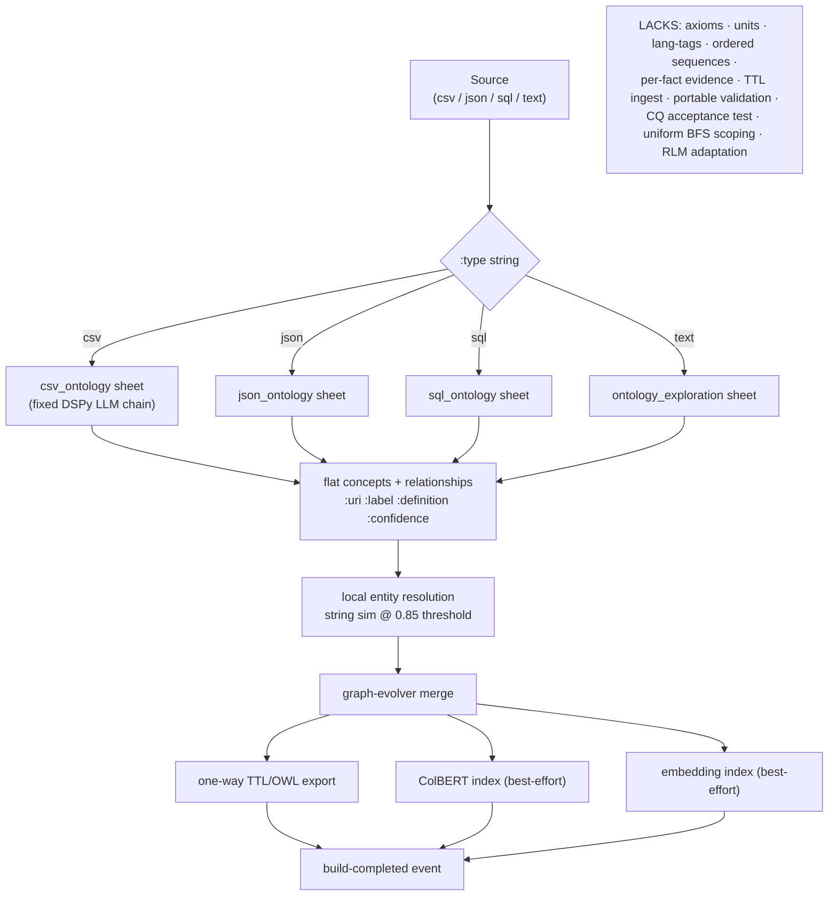
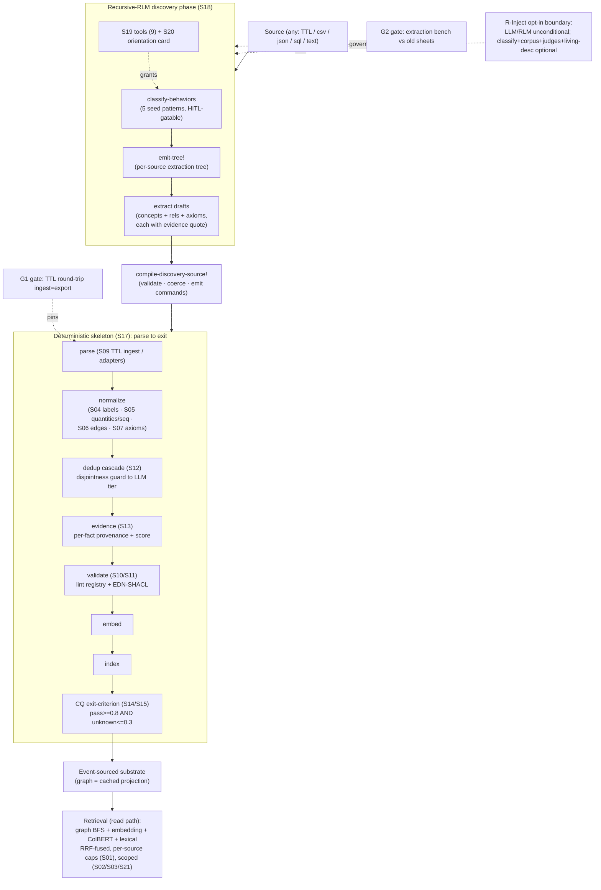

# Ontology Workflow: BEFORE vs AFTER the Substrate + Builder Rebuild

*Authoritative architectural comparison of ORC's evolutionary-ontology system before and after the 20-slice rebuild initiative (S01–S21 + live-verify fixes). Read-only research; every claim cites real code.*

---

## Executive Summary

**Before**, the evolutionary-ontology system was a sequential, format-keyed extraction pipeline. `evolutionary_builder.clj` (`build-from-sources` / `evolve`, `components/ontology/src/ai/obney/orc/ontology/core/evolutionary_builder.clj:644-993`) dispatched each source to one of four hand-authored ORC behavior-tree sheets (`csv_ontology`, `json_ontology`, `sql_ontology`, `ontology_exploration` under `components/ontology/src/ai/obney/orc/ontology/sheets/`), each a port of a fixed DSPy-style LLM chain (`csv_ontology.clj:1-17`). Extraction produced flat concepts + basic relationships, ran a local string/threshold entity-resolution pass (`entity-resolver/resolve-within-batch`, called at `evolutionary_builder.clj:709`), merged into a graph, emitted a TTL snapshot, and optionally built ColBERT/embedding indexes. There were **no axioms, no units, no language-tagged labels, no per-fact evidence, no TTL ingest (export was one-way and lossy), no portable validation, and no acceptance test** that the build answered the consumer's questions. The component doc framed it narrowly as a three-layer Failure/Success/Problem profiling system (`docs/ONTOLOGY.md:18-25`).

**After**, the system is a *hybrid*: a hand-authored **deterministic skeleton** owns the substrate contracts (`deterministic_skeleton.clj`, S17 — `parse → normalize → dedup → validate → embed → index → exit-criterion`) while a **recursive-RLM discovery phase** (`rlm_discovery.clj`, S18) designs the per-source extraction tree, guided by a seed corpus and the S19 ontology tools + S20 orientation card. The representation gained the eight-part bundle (labels/datatypes/quantities/sequences/edge-metadata/axioms/equivalences/annotations, M2). Dedup became a tiered cascade with a disjointness KEEP-guard and equivalence-kind verdicts (S12). Evidence is now per-fact and deterministic (S13). Validation is a portable lint registry + EDN-SHACL interpreter that exports real SHACL (S10/S11). TTL is a faithful round-trip with a hard `ingest→export` gate (S09/G1), and the build is gated on a competency-question acceptance test (S14/S15). **Thesis: the new system can replace the old because it preserves the old's job (turn disparate sources into one growing graph) but moves the substrate contracts — scoping, representation fidelity, dedup correctness, evidence, portable validation, and an acceptance test — into a deterministic spine that an adaptive, self-improving discovery layer plugs into, rather than baking extraction into per-format LLM chains with no quality gate.**

> Live-verification of the four LLM-bearing slices (S12, S15, S18, S19) is documented separately in [`2026-06-13-ontology-rebuild-live-verify-results.md`](./2026-06-13-ontology-rebuild-live-verify-results.md). This document does not restate those results; it references them where the capability claim depends on a proven run.

---

## BEFORE — The Sequential Builder

### How it worked

`build-from-sources` (`evolutionary_builder.clj:644`) ran eight phases in a fixed sequence:

1. **Register sources** — content-hash dedup of source files (`register-sources`, `:553`).
2. **Extract** — `extract-from-all-sources` (`:561`) dispatched each source by `:type` string to `extract-from-source` (`:485`), which routed `"csv"`/`"text"`/`"sql"`/`"json"` to the matching ORC sheet via `requiring-resolve` (`ensure-csv-sheet!` etc., `:137-175`). Each sheet was a **fixed LLM chain** — e.g. the CSV sheet ports DSPy signatures `AnalyzeCSVSchema`, `EnrichEntityDefinition`, `SuggestHierarchy`, `DiscoverImplicitRelationships`, `DetectAmbiguity` (`csv_ontology.clj:1-17`). Output was mapped to a flat `{:concepts [...] :relationships [...] :tbox {...} :abox [...]}` shape (`:234-267`).
3. **Entity resolution** — `entity-resolver/resolve-within-batch` with a `:similarity-threshold` default of `0.85` and optional `owl:sameAs` emission (`default-config`, `:47-62`; call at `:709`). This is **local string/threshold matching** — no disjointness guard, no equivalence-kind, no LLM adjudication band.
4. **Graph evolution** — `graph-evolver/evolve-graph!` merged concepts/relationships (`:716`).
5. **TTL snapshot** — `generate-owl-ttl-snapshot` produced a one-way OWL/TTL **export** (`:726`). There was no path back in.
6. **ColBERT index** (best-effort, swallows exceptions, `:737-748`).
7. **Embedding index** (best-effort, swallows exceptions, `:759-773`).
8. **Completion event** with counts (`:807`).

`evolve` (`:853`) was the incremental twin: load prior concept events, `resolve-incremental` preferring existing URIs, merge, re-snapshot.

### What it LACKED (verified by absence in the source)

- **No source adaptation** — the extraction shape per format was hardcoded in a sheet; a new source type meant a new sheet.
- **No axioms / units / language tags / ordered sequences** — concepts carried `:uri :label :definition :entity-type :confidence` only (`:234-243`).
- **No per-fact evidence / provenance** — only a scalar `:confidence` default of `0.8` or `1.0`.
- **No TTL ingest** — `"rdf"` extraction was a stub returning empty (`:517`); export was lossy (open metadata bag never serialized — see PRD problem 4, `prd:50-53`).
- **No portable validation** — quality checks, where they existed, were internal and unexported.
- **No competency-question acceptance test** — a build that *ran* was the only success signal.
- **Leaky scoping** — graph BFS ignored ontology scoping while embedding/ColBERT enforced it (PRD problem 1, `prd:36-40`).
- **Best-effort indexing that swallowed errors** (`:746`, `:771`) — violating the project's "no silent fallback" discipline.

### BEFORE diagram



```text
BEFORE (sequential, format-keyed)

  Source (csv/json/sql/text)
        |
        v
  dispatch on :type string  -->  [one FIXED sheet per format]
        |                          csv_ontology / json_ontology /
        |                          sql_ontology / ontology_exploration
        v                          (each a hardcoded LLM chain)
  flat concepts + relationships  (uri,label,definition,confidence)
        |
        v
  local entity resolution  (string similarity @ 0.85)
        |
        v
  graph-evolver merge
        |
        +--> one-way TTL/OWL export (lossy; no ingest)
        +--> ColBERT index (best-effort, errors swallowed)
        +--> embedding index (best-effort, errors swallowed)
        |
        v
  build-completed event   <-- the ONLY success signal

  LACKS: axioms, units, language tags, ordered sequences,
         per-fact evidence, TTL round-trip, portable validation,
         CQ acceptance gate, uniform graph-BFS scoping, RLM adaptation
```

---

## AFTER — The Hybrid Builder

### How it works

Two coordinated halves, joined by `discover-and-build!` (`rlm_discovery.clj:506`).

**(A) Recursive-RLM discovery (S18, `rlm_discovery.clj`).** `run-discovery!` (`:148`) constructs a recursive-RLM `:repl-researcher` session (`:rlm {:recursive? true ...}`, forced recursive — terminal mode refused, `:42-51`) granted:
- the **S19 ontology tools** via `:granted-ontology-id` (`build-rlm-config`, `:111-126`),
- the **S20 orientation card** (injected when tools are granted),
- the **ontology-discovery seed corpus** through `classify-behaviors` (`seeds/ontology-discovery-patterns`, 5 patterns with `:hitl-status :auto-derived | :hitl-reviewed`).

The model classifies its task, retrieves a fitting discovery pattern, `emit-tree!`s a per-source extraction tree, runs it, and recovers from failed leaves across iterations. It returns concept/relationship/axiom **drafts**, each required to carry a verbatim evidence quote (`default-discovery-prompt`, `:75-109`). `compile-discovery-source!` (`:428`) validates the drafts (raising on malformed — no silent drop, `:343-355`), coerces model-invented scopes/confidence-classes to the enum (`:357-388`), and emits them through the standard `:ontology/create-concept` / `:ontology/create-relationship` commands — then hands S17 a no-op `:inline-concepts` stub so the skeleton stays unmodified. **Axiom drafts are a known gap** — preserved in provenance as `:axioms-skipped`, not yet dispatched into the S07 command surface (`:455-460`, `:493`).

**(B) Deterministic skeleton (S17, `deterministic_skeleton.clj`).** `build!` (`:469`) drives seven stages in load-bearing order, each returning `{:status :ok}` or a structured per-stage failure that the driver translates to `:failed-at-<stage>` with the root cause verbatim (no try/catch swallowing, `:462-467`, `:530-626`):

1. **parse** (`:84`) — delegates to S09 TTL ingest or per-type adapters; unknown types fail loudly (`:145-148`).
2. **normalize** (`:158`) — verify-and-summarize for the TTL path (the ingester already emitted bundle features); the seam where a model-authored normalizer would plug in.
3. **dedup** (`:211`) — runs the **S12 cascade** over candidate pairs (token-blocked, `:191-209`); S13 evidence aggregation fires automatically inside the cascade command; budget exhaustion surfaces `:requires-review`, never a silent merge.
4. **validate** (`:302`) — registers shapes + runs the **S10/S11 lint registry**; `:violation` HALTS (configurable `:halt-on`); warnings/infos collected (`:560-570`).
5. **embed** (`:362`) / 6. **index** (`:383`) — caller-supplied fns (production wires `embedding/embed-concepts-batch!`; default skip).
7. **exit-criterion** (`:398`) — reads the **ORSD spec (S14)** and runs the **S15 CQ runner**; gates on `pass-rate ≥ 0.8 AND unknown-rate ≤ 0.3` (`default-exit-criterion`, `:392`); failure → `:failed-cq` (events that landed stay — events are facts).

On `:complete` it also exports SHACL TTL into `:artifacts` (`:621`).

### The two hard gates

- **G1 — TTL round-trip** (gates M2+M3). `ttl_ingest/ingest-ttl!` decomposes TTL into the event vocabulary; `ttl_canonicalize/canonicalize-ttl` + `semantic-diff` prove `ingest(ttl) → events → export ≍ source` at the triple-set level (URDNA2015 via rdflib). All bundle features round-trip with kind/unit/metadata preserved (commit `9dec70ac`, S09).
- **G2 — extraction bench** (gates M8). Sources with known-good expected graphs, scored on precision/recall, old sheets as the baseline the RLM path must beat (commit `879c1f90`, S16; PRD Testing Decisions `prd:491-495`).

### Retrieval (the read path)

`retrieval/hybrid-search` fuses **graph BFS + embedding + ColBERT + lexical** signals via RRF (`rrf-k 60`). S01 applies **per-source caps before fusion** so one over-expanding signal can't drown the pool (commit `30e25524`). S02 makes **ontology-id scoping uniform** — graph BFS now routes through the scoped `build-concept-graph` (closing the old leak); S03 adds an **alignment-section registry** with auto-widening for deliberate cross-section queries. **S21 added a first-class lexical signal** that scans scoped concept labels (exact > prefix > whole-word > substring) and bootstraps the graph-BFS `:seed-uris` when the caller supplies none — fixing the "all signals dark on a bare text query" failure that the S19 live run exposed (see live-verify results, "Fix 1").

### Agent access + self-improvement boundary

The 9 ontology tools (`sandbox_tools.clj`: `graph-search`, `neighborhood`, `get-concept`, `exists?`, `absent-in-graph?`, `find-edges` [added S21], `filter-by-label-pattern`, `classify-task`, `classify-behaviors`) are exposed only when an `event-store` + grant are present; the granted-ontology-id is authoritative and a model-supplied `:ontology-id` is stripped. The **S20 orientation card** (`orientation_card.clj`, `render-card` / `card-for`) is a deterministic-from-projections four-layer preview (identity/ORSD · T-Box digest · content sample · tool affordances), cached and reindex-invalidated. The live runs proved the card is **load-bearing, not polish** — injecting the tool docstrings was the lever between an agent that guesses shapes and one that copies the call form (live-verify results, S19 run #6).

The **R-Inject boundary** is the self-improvement opt-in: recursive-RLM + LLM use inside discovery is *unconditional* (budget-knobbed); what's optional is auto-classification + corpus prepend + judges + living-description evolution (`rlm_discovery.clj:26-42`; PRD cross-cutting invariant `prd:244-248`). A consumer can use the ontology "as a database" with all of that dormant.

### AFTER diagram



```text
AFTER (hybrid: adaptive discovery + deterministic spine)

  Source (any format, incl. existing TTL)
        |
        v
  [ RECURSIVE-RLM DISCOVERY  (S18) ]            R-Inject opt-in governs
    classify-behaviors (5 seed patterns)         self-improvement only;
        -> emit-tree! (per-source tree)          LLM/RLM use is uncond.
        -> extract drafts (+ evidence quotes)
    granted: S19 tools (9) + S20 orientation card
        |
        v   compile-discovery-source! (validate, coerce, emit commands)
        |
  [ DETERMINISTIC SKELETON  (S17) ]
    parse  --> normalize ----> dedup -----> evidence --> validate -> embed -> index -> CQ exit
   (S09)     (S04 labels       (S12         (S13         (S10/S11                       (S14/S15
              S05 qty/seq        cascade,     per-fact     lints +                        pass>=0.8
              S06 edges          disjoint     provenance   EDN-SHACL)                     unk<=0.3)
              S07 axioms)        guard ->     + score)
                                 LLM tier)
        |
        v
  Event-sourced substrate  (graph = cached projection)
        |
        v
  RETRIEVAL (read path): graph BFS + embedding + ColBERT + LEXICAL
    RRF-fused, per-source caps (S01), uniform scoping (S02/S03), lexical bootstrap (S21)

  GATES:  G1 = TTL round-trip (ingest == export)   pins parse + schema bundle
          G2 = extraction bench vs old-sheet baseline   pins discovery
```

---

## Capability-Delta Table

| Axis | BEFORE | AFTER | Grounding |
|------|--------|-------|-----------|
| **Source adaptation** | Fixed sheet per `:type` string; new format = new hand-authored sheet | Recursive-RLM designs the extraction tree per source via `emit-tree!`, guided by seed corpus | `evolutionary_builder.clj:485-531` (dispatch) vs `rlm_discovery.clj:148-319` (S18) |
| **Representation** | Concepts (`:uri :label :definition :entity-type :confidence`) + basic relationships | Eight-part bundle: labels/datatypes/annotations (S04), quantities+units & ordered sequences (S05), schema'd edge metadata (S06), axioms-as-data (S07), equivalences-with-kind (S08) | `evolutionary_builder.clj:234-243` vs commits `14417ee4`/`ece15123`/`b4dbd360`/`441fb629`/`3bad60c8`; PRD M2 `prd:273-296` |
| **Dedup** | Local string-similarity resolution @ 0.85 threshold; optional `owl:sameAs` | Tiered cheapest-first cascade: disjointness KEEP-guard (T1) → number/negation/entropy/type/exact/LSH/Jaro-Winkler → focused LLM merge/keep with equivalence-kind, only in ambiguity band; budget-exhaust → `:requires-review` (never silent merge) | `entity-resolver` call `evolutionary_builder.clj:709` vs `dedup_cascade.clj:1-53,347-455` (S12) |
| **Evidence** | None (scalar `:confidence` defaults of 0.8/1.0) | Per-fact provenance ledger + deterministic, replay-stable evidence score (diversity-weighted, log-saturated, contradiction-aware); emitted automatically on the compare-to-existing path | `evidence.clj:35-168` (score) + `:174-245` (aggregation); S13 commit `34ba2888` |
| **Validation** | ORC-internal at best; nothing portable | Unified lint registry (11 built-in lints across S10/S11) + EDN-SHACL interpreter (counts, datatype, pattern, `:not`, qualified-value-shapes, `:code` escape hatch) + real **SHACL TTL export** for independent re-validation | `lints/builtin.clj` (11 lints) + `lints/interpreter.clj`; commits `3a3f0de9` (S10), `39e55fb8` (S11) |
| **Interchange** | One-way lossy TTL/OWL export; `"rdf"` ingest a stub returning `{}` | Faithful TTL **round-trip**: `ingest-ttl!` decomposes → events; re-export is triple-set-equal; G1 gate pins schemas + serializer with kind/unit/metadata preserved | `evolutionary_builder.clj:517` (stub) vs `ttl_ingest.clj` + `ttl_canonicalize.clj`; commit `9dec70ac` (S09) |
| **Acceptance test** | None — a build that ran was the only signal | ORSD spec storage (S14) + CQ runner (S15) with three-layer open-world negation posture (Layer-1 deterministic, Layer-2/3 judge with explicit-`:unknown`); build gated on pass-rate/unknown-rate | (absent before) vs `cq_runner.clj:1-65,405-463`; commits `6c6de292` (S14), `52a73a50` (S15) |
| **Scoping / isolation** | Graph BFS ignored scoping (leak); cross-ontology results lost fusion | Uniform ontology-id scoping across all signals (S02); alignment-section registry with auto-widening (S03); per-source RRF caps (S01) | PRD problem 1 `prd:36-40` vs `retrieval.clj` (`build-concept-graph` scoped, BFS routes through it); commits `30e25524` (S01), `4e67845f` (S03) |
| **Retrieval** | graph BFS + embedding + ColBERT — *dark without seeds/embeddings* on a bare text query | + first-class **lexical signal** (exact>prefix>word>substring) that is both an RRF signal and a seed-URI bootstrap for graph BFS | `retrieval.clj` hybrid-search + S21 lexical signal; live-verify "Fix 1" |
| **Agent access** | None | 9 RLM sandbox tools (`graph-search`, `neighborhood`, `get-concept`, `exists?`, `absent-in-graph?`, `find-edges`, `filter-by-label-pattern`, `classify-task`, `classify-behaviors`) + deterministic four-layer **orientation card** | `sandbox_tools.clj:114-676` (S19) + `orientation_card.clj` (S20); commit `877e24d1` |
| **Self-improvement** | Tree-profiling / failure-classification only (the old three-layer doc framing) | General-purpose substrate + R-Inject opt-in (classify + corpus prepend + judges + living-desc) with LLM use unconditional; behavioral mint surface | `docs/ONTOLOGY.md:18-25` (old framing) vs `rlm_discovery.clj:26-42`; PRD `prd:244-248` |

---

## What Remains / Honest Gaps

- **Axiom drafts are not yet ingested.** `compile-discovery-source!` emits concept + relationship drafts but records axiom-drafts only as `:axioms-skipped` in provenance — wiring them into the S07 command surface is explicitly flagged as future work (`rlm_discovery.clj:455-460,493`).
- **Old sheets are still present** as the regression baseline; deprecation is Phase-4 work and is gated on the RLM path beating them on the G2 extraction bench (`deterministic_skeleton.clj:62-63`; PRD M8 `prd:430-432`). The `evolutionary_builder.clj` path is untouched and still functions.
- **The skeleton's `normalize` stage is a verify-and-summarize no-op for the TTL path.** Non-TTL label normalization / quantity coercion / edge stamping is described as the seam where a model-authored normalizer *would* plug in — it is decoupled but not yet populated for non-TTL adapters (`deterministic_skeleton.clj:158-181`, ns docstring `:18-24`).
- **CQ judge posture is a live calibration decision, now applied.** The S15 judge defaulted to **open-world `:unknown`** (a missing per-subject fact is `:unknown` unless an explicit closure/negation signal exists). This was a deliberate HITL calibration, live-verified, not an untested default (live-verify results, "S15 calibration decision — APPLIED").
- **Discovery determinism knob (pin a recorded tree) is specified but not evidenced in the read code** — PRD M8 lists it (`prd:428`); I found no implementing fn in the discovery namespace. Treat as PRD-stated, not yet built.

---

## Adversarial Note — PRD vs Actual Code

Things the PRD claims that the code implements *differently* or only *partially*:

1. **Tool count.** PRD M9 enumerates 8 builder-facing tools (`prd:436-438`). The shipped set is **9** — `find-edges` was added during S19 live-verify as a genuine capability gap (no tool answered "which subjects have predicate P"), not in the original PRD (`sandbox_tools.clj:386-436`; live-verify "Fix 3").
2. **Dedup tier list.** PRD M5 lists "MinHash/LSH blocking" (`prd:354`). The implementation uses a **word-token + 3-shingle Jaccard proxy**, not true MinHash/LSH; the docstring is explicit that production-tier LSH is a future optimization (`dedup_cascade.clj:176-192`; skeleton blocking note `deterministic_skeleton.clj:191-200`). Functionally equivalent for the current scale, but not the named algorithm.
3. **Check-before-mint** is described as a builder graph-merge-stage search against other sections (`prd:367-368`). It exists as a hook *inside* the S12 cascade command rather than as a separate merge-stage pass (`deterministic_skeleton.clj:26-28` references "check-before-mint hook fires inside S12's command"). Same effect, different location than the PRD's prose implies.
4. **Concept-pair co-occurrence counts "recorded from day one"** (PRD M5, `prd:362-364`) — I did not find evidence of co-occurrence event recording in the cascade or skeleton read. Possibly elsewhere, but unverified; flag as not-confirmed.
5. **Determinism knob** (PRD M8, `prd:428`) — specified, not found in code (see Gaps above).
6. **CQ closed-world posture flipped post-PRD.** The PRD's CQ section (`prd:402-405`) describes the judge as the closed-world evaluator; the live calibration explicitly **changed the default to open-world `:unknown`** after the Mira-Sun boundary case. The shipped prompt (`cq_runner.clj:75-131`) is open-world-first — a deliberate, documented deviation from the PRD's framing, not a defect.

None of these contradict the PRD's *intent*; they are scope/algorithm/location refinements that surfaced during build and live-verify, plus one PRD item (determinism knob) and one (co-occurrence counts) I could not confirm in code.
